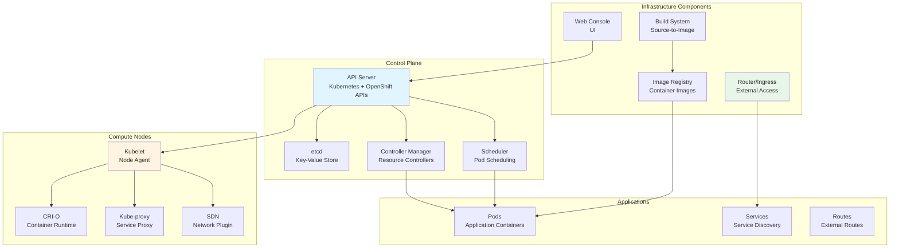
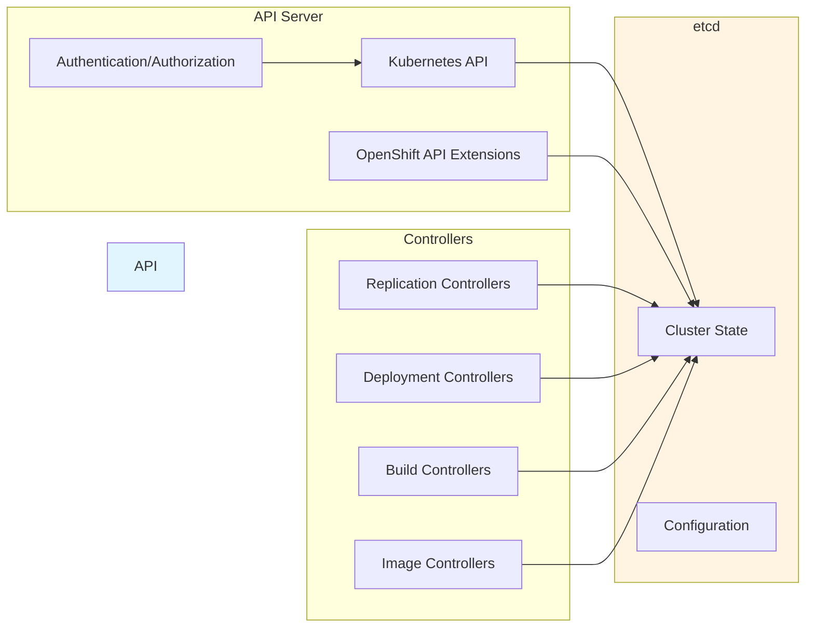
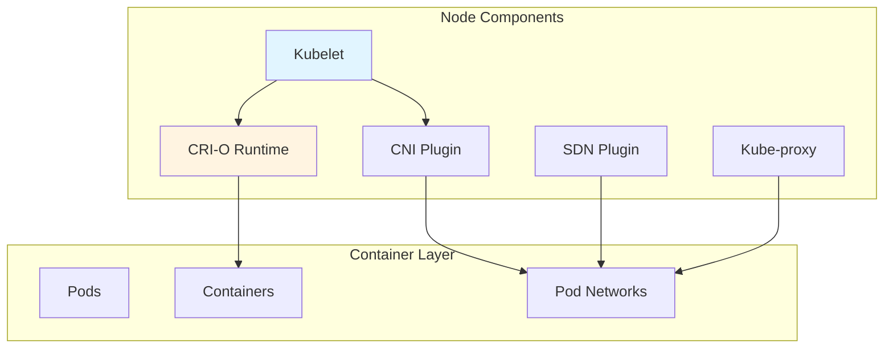
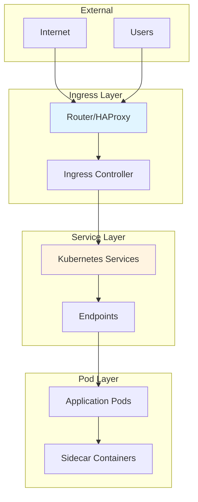
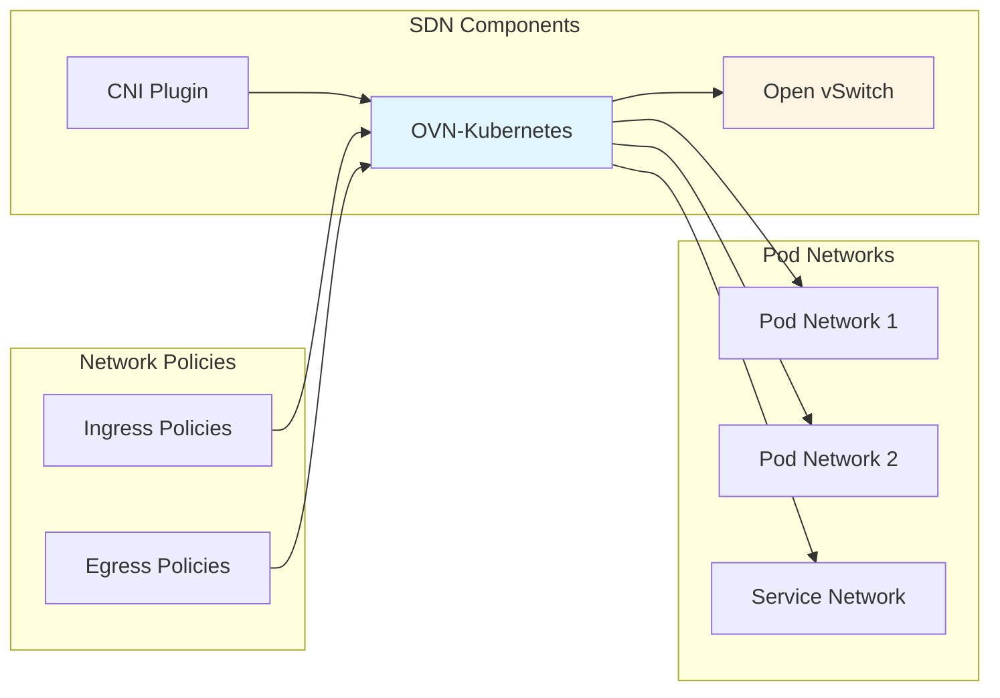
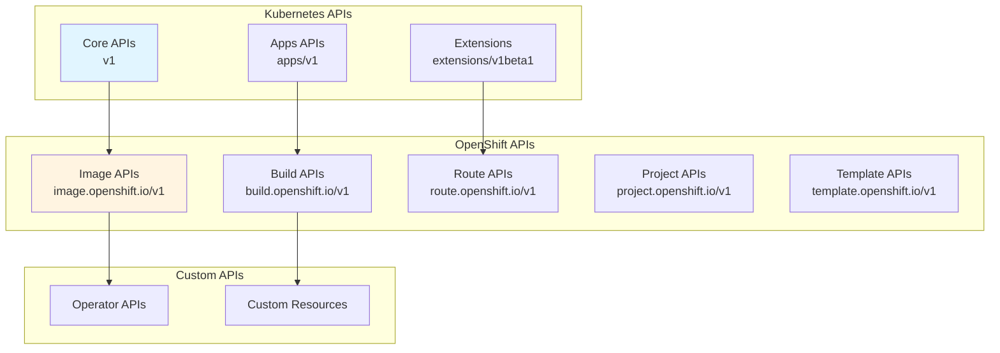
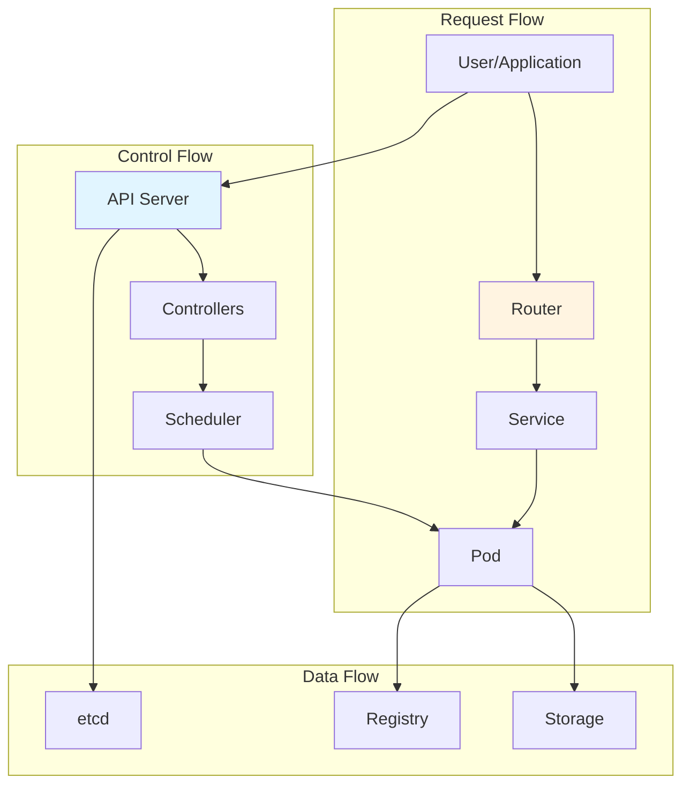
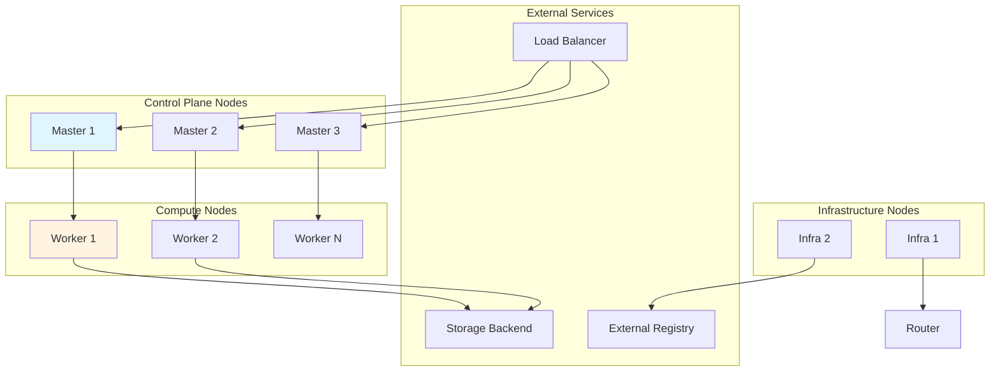
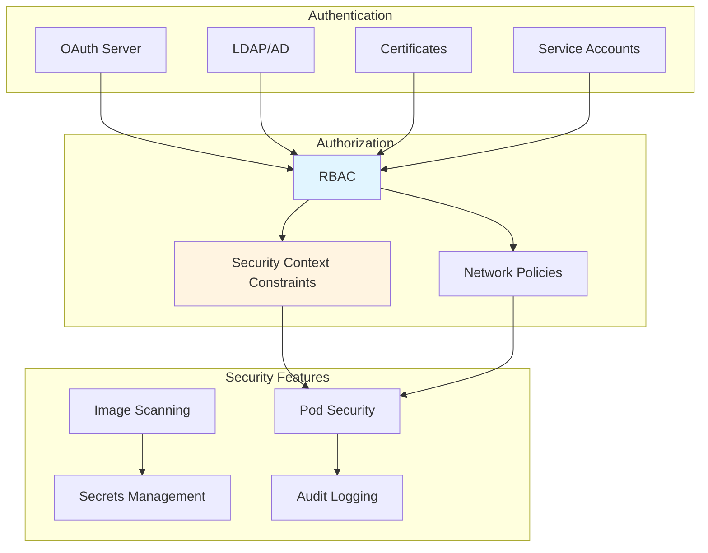
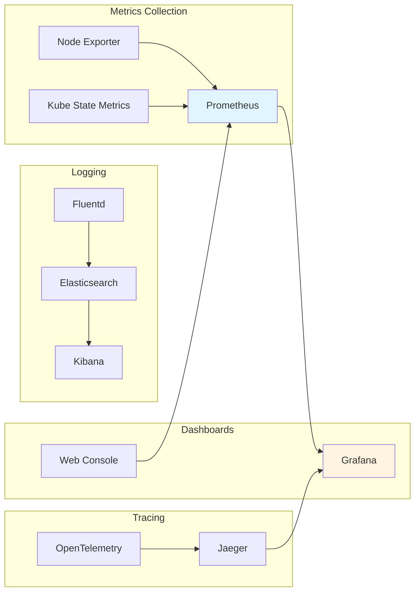

# OpenShift Architecture Documentation

## System Architecture

OpenShift is built on Kubernetes and extends it with additional components and APIs. The architecture consists of control plane nodes, compute nodes, and infrastructure components working together.

### High-Level Architecture Diagram



## Component Architecture

### Control Plane Components



### Node Components



## Network Architecture

### Network Flow



### SDN Architecture



## API Architecture

### API Server Flow

```mermaid
sequenceDiagram
    participant Client
    participant Auth as Authentication
    participant Authz as Authorization
    participant API as API Server
    participant etcd as etcd
    participant Controller as Controllers
    
    Client->>Auth: Request with Credentials
    Auth->>Auth: Validate Token/Cert
    Auth->>Authz: Check Permissions
    Authz->>API: Authorized Request
    API->>etcd: Read/Write State
    etcd->>API: State Response
    API->>Controller: Resource Change Event
    Controller->>API: Update Resource
    API->>Client: Response
    
    style API fill:#e1f5ff
    style etcd fill:#fff4e1
```

### API Group Structure



## Component Interaction Diagram



## Deployment Architecture

### Cluster Topology



## Key Design Patterns

### 1. Controller Pattern
OpenShift uses the Kubernetes controller pattern extensively:
- Watch resources via informers
- Reconcile desired state
- Handle errors gracefully
- Update resource status

### 2. Operator Pattern
Operators extend OpenShift functionality:
- Custom resources for application management
- Automated operations
- Lifecycle management
- Self-healing capabilities

### 3. Declarative Configuration
Everything is defined declaratively:
- YAML/JSON resource definitions
- Desired state management
- GitOps-friendly
- Version-controlled

### 4. Event-Driven
System responds to events:
- Resource changes trigger controllers
- Webhooks trigger actions
- Metrics trigger alerts
- Logs trigger analysis

### 5. Multi-Tenancy
Strong isolation between tenants:
- Projects/namespaces
- Resource quotas
- Network policies
- RBAC

## Security Architecture



## Scalability Considerations

1. **Horizontal Scaling**: Add more nodes to scale capacity
2. **Vertical Scaling**: Increase node resources
3. **API Server Scaling**: Multiple API server instances
4. **etcd Scaling**: etcd cluster for high availability
5. **Controller Scaling**: Controllers can scale horizontally

## Monitoring and Observability



