# AWS (Amazon Web Services) Architecture

## Overview

This diagram provides a beginner-friendly view of how Amazon Web Services (AWS) is structured and how its major services work together. The architecture is organized into logical layers that show the flow from users and applications down to the underlying infrastructure.

## Architecture Diagram

```mermaid
graph TB
    subgraph "User & Application Layer"
        Users[👥 Users]
        WebApp[🌐 Web Applications]
        MobileApp[📱 Mobile Apps]
        API[🔌 APIs]
    end

    subgraph "AWS Compute Layer"
        EC2[EC2<br/>Virtual Servers<br/>Run applications on virtual machines]
        Lambda[Lambda<br/>Serverless Functions<br/>Run code without managing servers]
        ECS[ECS<br/>Elastic Container Service<br/>Run Docker containers]
        EKS[EKS<br/>Elastic Kubernetes Service<br/>Managed Kubernetes clusters]
    end
    
    subgraph "AWS Networking Layer"
        VPC[VPC<br/>Virtual Private Cloud<br/>Isolated network environment]
        ALB[ALB<br/>Application Load Balancer<br/>Distribute traffic]
        NLB[NLB<br/>Network Load Balancer<br/>High-performance load balancing]
        APIGW[API Gateway<br/>API Management<br/>Create and manage REST/HTTP APIs]
        CloudFront[CloudFront<br/>Content Delivery Network<br/>Fast content delivery worldwide]
    end
    
    subgraph "AWS Storage Layer"
        S3[S3<br/>Simple Storage Service<br/>Object storage for files]
        EBS[EBS<br/>Elastic Block Store<br/>Block storage for databases]
        RDS[RDS<br/>Relational Database Service<br/>Managed SQL databases]
        DynamoDB[DynamoDB<br/>NoSQL Database<br/>Fast, flexible NoSQL database]
        EFS[EFS<br/>Elastic File System<br/>Shared file storage]
    end
    
    subgraph "AWS Security Layer"
        IAM[IAM<br/>Identity & Access Management<br/>Control who can access what]
        KMS[KMS<br/>Key Management Service<br/>Encryption key management]
        WAF[WAF<br/>Web Application Firewall<br/>Protect web applications]
        Shield[Shield<br/>DDoS Protection<br/>Protect against attacks]
        SecretsManager[Secrets Manager<br/>Store and rotate secrets]
    end
    
    subgraph "AWS Operations Layer"
        CloudWatch[CloudWatch<br/>Monitoring & Metrics<br/>Track performance and health]
        CloudTrail[CloudTrail<br/>Audit Logging<br/>Record API calls for compliance]
        XRay[X-Ray<br/>Distributed Tracing<br/>Trace requests across services]
        CodePipeline[CodePipeline<br/>CI/CD Pipeline<br/>Automate build and deployment]
        CodeBuild[CodeBuild<br/>Build Service<br/>Compile and test code]
        CodeDeploy[CodeDeploy<br/>Deployment Service<br/>Deploy applications]
    end

    subgraph "AWS Infrastructure Layer"
        Regions[🌍 Regions<br/>Geographic locations<br/>e.g., us-east-1, eu-west-1]
        AvailabilityZones[Availability Zones<br/>Isolated data centers<br/>For high availability]
        DataCenters[🏢 Data Centers<br/>Physical infrastructure<br/>Servers and networking]
    end

    %% User to Application connections
    Users --> WebApp
    Users --> MobileApp
    WebApp --> API
    MobileApp --> API

    %% Application to AWS connections
    API --> APIGW
    APIGW --> ALB
    ALB --> EC2
    ALB --> ECS
    ALB --> EKS
    APIGW --> Lambda
    CloudFront --> S3
    CloudFront --> ALB

    %% Networking connections
    EC2 --> VPC
    Lambda --> VPC
    ECS --> VPC
    EKS --> VPC
    RDS --> VPC
    ALB --> VPC
    NLB --> VPC

    %% Storage connections
    EC2 --> EBS
    EC2 --> S3
    EC2 --> EFS
    ECS --> RDS
    EKS --> RDS
    Lambda --> DynamoDB
    Lambda --> S3
    WebApp --> S3

    %% Security connections
    EC2 --> IAM
    Lambda --> IAM
    ECS --> IAM
    EKS --> IAM
    S3 --> KMS
    RDS --> KMS
    EBS --> KMS
    ALB --> WAF
    CloudFront --> Shield
    Lambda --> SecretsManager
    EC2 --> SecretsManager

    %% Operations connections
    EC2 --> CloudWatch
    Lambda --> CloudWatch
    ECS --> CloudWatch
    EKS --> CloudWatch
    RDS --> CloudWatch
    S3 --> CloudTrail
    EC2 --> CloudTrail
    Lambda --> XRay
    ECS --> XRay
    CodePipeline --> CodeBuild
    CodePipeline --> CodeDeploy
    CodeDeploy --> EC2
    CodeDeploy --> ECS
    CodeDeploy --> Lambda

    %% Infrastructure connections
    VPC --> Regions
    EC2 --> AvailabilityZones
    ECS --> AvailabilityZones
    EKS --> AvailabilityZones
    RDS --> AvailabilityZones
    AvailabilityZones --> Regions
    Regions --> DataCenters

    style Users fill:#e1f5ff
    style WebApp fill:#e1f5ff
    style MobileApp fill:#e1f5ff
    style API fill:#e1f5ff
    style EC2 fill:#ff9900
    style Lambda fill:#ff9900
    style ECS fill:#ff9900
    style EKS fill:#ff9900
    style S3 fill:#ff9900
    style RDS fill:#ff9900
    style IAM fill:#ff9900
    style CloudWatch fill:#ff9900
    style VPC fill:#ff9900
    style DataCenters fill:#f0f0f0
    style Regions fill:#f0f0f0
    style AvailabilityZones fill:#f0f0f0
```

## Architecture Layers Explained

### 1. User & Application Layer
This is where end users interact with applications through web browsers, mobile apps, or API clients. Applications at this layer make requests to backend services hosted on AWS.

### 2. Compute Layer
**Purpose**: Provides the processing power to run applications and services.

- **EC2 (Elastic Compute Cloud)**: Virtual servers that you can configure and manage. Like having your own computer in the cloud.
- **Lambda**: Serverless functions that run code without managing servers. Pay only for execution time.
- **ECS (Elastic Container Service)**: Run Docker containers without managing the underlying infrastructure.
- **EKS (Elastic Kubernetes Service)**: Fully managed Kubernetes service for running containerized applications at scale.

**How it works**: Applications are deployed to these compute resources, which can scale up or down based on demand. EC2 gives you full control, while Lambda, ECS, and EKS provide more managed options.

### 3. Networking Layer
**Purpose**: Connects services, routes traffic, and provides secure communication.

- **VPC (Virtual Private Cloud)**: Your own isolated network in AWS. Like a private section of the internet.
- **ALB (Application Load Balancer)**: Distributes incoming application traffic across multiple targets (EC2, containers).
- **NLB (Network Load Balancer)**: High-performance load balancer for TCP/UDP traffic.
- **API Gateway**: Creates, publishes, and manages REST and HTTP APIs. Acts as a front door for your backend services.
- **CloudFront**: Content Delivery Network (CDN) that delivers content from locations closest to users for faster access.

**How it works**: Traffic flows from users through API Gateway and load balancers to the appropriate compute resources. VPC isolates your resources, and CloudFront caches content globally for better performance.

### 4. Storage Layer
**Purpose**: Stores data persistently for applications and users.

- **S3 (Simple Storage Service)**: Object storage for files, images, videos, backups. Highly durable and scalable.
- **EBS (Elastic Block Store)**: Block storage volumes attached to EC2 instances. Like a hard drive for your virtual machine.
- **RDS (Relational Database Service)**: Managed SQL databases (MySQL, PostgreSQL, Oracle, SQL Server). Handles backups, patching, and scaling.
- **DynamoDB**: Fast, flexible NoSQL database. Great for applications that need consistent, single-digit millisecond latency.
- **EFS (Elastic File System)**: Shared file storage that multiple EC2 instances can access simultaneously.

**How it works**: Applications read and write data to storage services. S3 is for files and static content, EBS is for databases on EC2, RDS is for managed SQL databases, and DynamoDB is for high-performance NoSQL needs.

### 5. Security Layer
**Purpose**: Protects resources, manages access, and encrypts data.

- **IAM (Identity & Access Management)**: Controls who can access AWS resources and what they can do. Defines users, groups, roles, and policies.
- **KMS (Key Management Service)**: Creates and manages encryption keys used to encrypt your data.
- **WAF (Web Application Firewall)**: Protects web applications from common web exploits and bots.
- **Shield**: Managed DDoS (Distributed Denial of Service) protection service.
- **Secrets Manager**: Securely stores and rotates secrets like database passwords and API keys.

**How it works**: IAM controls access to all AWS resources. KMS manages encryption keys for data at rest and in transit. WAF and Shield protect against attacks. Secrets Manager keeps sensitive information secure.

### 6. Operations Layer
**Purpose**: Monitors system health, logs events, and automates deployments.

- **CloudWatch**: Monitors AWS resources and applications. Collects metrics, logs, and sets alarms.
- **CloudTrail**: Records API calls made to AWS services for security, compliance, and auditing.
- **X-Ray**: Traces requests as they travel through your distributed applications to identify bottlenecks.
- **CodePipeline**: Automates the build, test, and deployment phases of your release process.
- **CodeBuild**: Compiles source code, runs tests, and produces ready-to-deploy software packages.
- **CodeDeploy**: Automates code deployments to EC2, Lambda, ECS, or on-premises instances.

**How it works**: CloudWatch tracks performance and alerts on issues. CloudTrail records all API activity for compliance. X-Ray helps debug distributed systems. CodePipeline orchestrates the CI/CD process from code to deployment.

### 7. Infrastructure Layer
**Purpose**: The physical foundation - data centers and geographic distribution.

- **Regions**: Geographic locations where AWS has data centers (e.g., us-east-1 in Virginia, eu-west-1 in Ireland).
- **Availability Zones**: Isolated data centers within a region. Each region has multiple AZs for redundancy.
- **Data Centers**: Physical facilities housing servers, networking equipment, and storage systems.

**How it works**: AWS operates globally with regions and availability zones. Deploying across multiple AZs provides high availability and fault tolerance.

## Key Data Flows

### 1. User Request Flow
1. User makes a request through a web or mobile app
2. Request may go through CloudFront CDN for cached content
3. Request reaches API Gateway which routes to appropriate services
4. API Gateway forwards to Application Load Balancer
5. Load balancer distributes traffic to available EC2 instances or containers
6. Application processes the request, potentially accessing S3, RDS, or DynamoDB
7. Response flows back through the same path to the user

### 2. Application Deployment Flow
1. Developer commits code to a repository (GitHub, CodeCommit)
2. CodePipeline detects the change and triggers a build
3. CodeBuild compiles the code, runs tests, and creates artifacts
4. CodeDeploy deploys the application to EC2, ECS, EKS, or Lambda
5. CloudWatch monitors the deployment and application health
6. If issues occur, CloudWatch triggers alarms and can rollback via CodeDeploy

### 3. Data Storage Flow
1. Application writes data to storage service (S3, RDS, DynamoDB)
2. Data is encrypted using keys from KMS
3. Data is replicated across multiple availability zones automatically
4. Access is controlled through IAM policies
5. All access is logged in CloudTrail for audit purposes
6. Backups are automatically created (for RDS) or can be versioned (for S3)

### 4. Auto-Scaling Flow
1. CloudWatch monitors metrics (CPU, memory, request count)
2. When thresholds are exceeded, Auto Scaling triggers
3. New EC2 instances or container tasks are launched
4. Load balancer automatically includes new instances in the pool
5. Traffic is distributed across all instances
6. When load decreases, extra instances are terminated to save costs

## Common Use Cases

### Web Application
- **Frontend**: Static files served via S3 + CloudFront CDN
- **Backend API**: Runs on EC2 instances or ECS containers
- **Load Balancing**: ALB distributes traffic across backend instances
- **Database**: RDS for SQL data, DynamoDB for NoSQL needs
- **Storage**: S3 for user uploads and media files
- **Security**: WAF protects against attacks, IAM controls access

### Microservices Architecture
- **API Gateway**: Routes requests to appropriate microservices
- **Services**: Each microservice runs in ECS or EKS containers
- **Service Discovery**: Built into ECS/EKS or use AWS App Mesh
- **Databases**: Each service may have its own RDS or DynamoDB table
- **Monitoring**: CloudWatch tracks each service, X-Ray traces requests across services

### Serverless Application
- **API Gateway**: Entry point for HTTP requests
- **Lambda Functions**: Execute business logic without managing servers
- **DynamoDB**: Store data with automatic scaling
- **S3**: Store static assets and trigger Lambda on file uploads
- **Event-Driven**: Functions respond to events (API calls, S3 uploads, database changes)
- **Auto-Scaling**: Automatically scales from zero to thousands of concurrent executions

## Security Best Practices

1. **Network Isolation**: Use VPCs to create isolated network environments. Use private subnets for databases.
2. **Identity Management**: Use IAM roles instead of access keys when possible. Follow principle of least privilege.
3. **Encryption**: Enable encryption at rest (using KMS) and in transit (using SSL/TLS). Encrypt EBS volumes and S3 buckets.
4. **Firewalls**: Use Security Groups (firewall rules) to restrict access. Use WAF for web application protection.
5. **Audit Logging**: Enable CloudTrail for all regions. Monitor CloudTrail logs for suspicious activity.
6. **Secrets Management**: Store secrets in Secrets Manager, not in code or configuration files.
7. **DDoS Protection**: Enable AWS Shield Standard (free) or Advanced (paid) for DDoS protection.

## Monitoring & Observability

- **CloudWatch Metrics**: Track CPU, memory, network, disk, and custom metrics from your applications
- **CloudWatch Logs**: Centralized logging from EC2, Lambda, ECS, and other services
- **CloudWatch Alarms**: Get notified when metrics exceed thresholds
- **CloudWatch Dashboards**: Visualize metrics and logs in custom dashboards
- **X-Ray**: Trace requests across distributed services to identify bottlenecks and errors
- **CloudTrail**: Audit log of all API calls for security and compliance

## Cost Optimization Tips

1. **Right-Sizing**: Choose appropriate EC2 instance types. Use CloudWatch to identify underutilized resources.
2. **Reserved Instances**: Purchase reserved instances for predictable workloads (up to 72% savings).
3. **Spot Instances**: Use Spot instances for fault-tolerant workloads (up to 90% savings).
4. **Auto Scaling**: Automatically scale down during low-traffic periods.
5. **S3 Lifecycle Policies**: Move old data to cheaper storage classes (Glacier, Deep Archive).
6. **Lambda**: Use Lambda for short-running tasks instead of always-on EC2 instances.

## Summary

AWS provides a comprehensive cloud platform organized into clear layers:

1. **Users** interact with applications
2. **Applications** run on compute resources (EC2, Lambda, ECS, EKS)
3. **Networking** (VPC, ALB, API Gateway, CloudFront) routes and balances traffic
4. **Storage** (S3, EBS, RDS, DynamoDB) persists data
5. **Security** (IAM, KMS, WAF, Shield) protects everything
6. **Operations** (CloudWatch, CloudTrail, CodePipeline) monitors and automates
7. **Infrastructure** (Regions, Availability Zones) provides global, resilient foundation

AWS services are designed to work together seamlessly, with built-in integrations and best practices for security, scalability, and reliability. The platform supports everything from simple web applications to complex, distributed microservices architectures.

