# Azure (Microsoft Azure) Architecture

## Overview

This diagram provides a beginner-friendly view of how Microsoft Azure is structured and how its major services work together. The architecture is organized into logical layers that show the flow from users and applications down to the underlying infrastructure.

## Architecture Diagram

```mermaid
graph TB
    subgraph "User & Application Layer"
        Users[👥 Users]
        WebApp[🌐 Web Applications]
        MobileApp[📱 Mobile Apps]
        API[🔌 APIs]
    end

    subgraph "Azure Compute Layer"
        VMs[Virtual Machines<br/>VMs<br/>Run applications on virtual machines]
        Functions[Azure Functions<br/>Serverless Functions<br/>Event-driven code execution]
        AKS[AKS<br/>Azure Kubernetes Service<br/>Managed Kubernetes clusters]
        AppService[App Service<br/>Web Apps & APIs<br/>Fully managed web hosting]
        ContainerInstances[Container Instances<br/>Serverless Containers<br/>Run containers without orchestration]
    end
    
    subgraph "Azure Networking Layer"
        VNet[Virtual Network<br/>VNet<br/>Isolated network environment]
        LoadBalancer_AZ[Load Balancer<br/>Traffic Management<br/>Distribute traffic across VMs]
        ApplicationGateway[Application Gateway<br/>Web Traffic Load Balancer<br/>Layer 7 load balancing]
        APIManagement[API Management<br/>API Gateway<br/>Create and manage APIs]
        FrontDoor[Azure Front Door<br/>CDN & WAF<br/>Global content delivery and protection]
    end
    
    subgraph "Azure Storage Layer"
        BlobStorage[Blob Storage<br/>Object Storage<br/>Store files and media]
        ManagedDisks[Managed Disks<br/>Block Storage<br/>Durable block storage for VMs]
        SQLDatabase[Azure SQL Database<br/>Managed SQL Database<br/>Fully managed SQL database]
        CosmosDB[Cosmos DB<br/>NoSQL Database<br/>Globally distributed NoSQL database]
        FileStorage[Azure Files<br/>File Shares<br/>SMB/NFS file shares]
        TableStorage[Table Storage<br/>NoSQL Database<br/>Key-value store]
    end
    
    subgraph "Azure Security Layer"
        AzureAD[Azure Active Directory<br/>Identity & Access Management<br/>Control access to resources]
        KeyVault[Key Vault<br/>Secrets Management<br/>Store and manage secrets and keys]
        Firewall[Azure Firewall<br/>Network Security<br/>Managed firewall service]
        DDoSProtection[DDoS Protection<br/>DDoS Mitigation<br/>Protect against attacks]
        WAF_AZ[Web Application Firewall<br/>WAF<br/>Protect web applications]
    end
    
    subgraph "Azure Operations Layer"
        Monitor[Azure Monitor<br/>Observability<br/>Metrics, logs, and alerts]
        LogAnalytics[Log Analytics<br/>Log Management<br/>Collect and analyze logs]
        ApplicationInsights[Application Insights<br/>Application Performance<br/>Monitor application health]
        DevOps[Azure DevOps<br/>CI/CD Pipeline<br/>Build, test, and deploy]
        ResourceManager[Resource Manager<br/>Infrastructure as Code<br/>Deploy and manage resources]
    end

    subgraph "Azure Infrastructure Layer"
        Regions_AZ[🌍 Regions<br/>Geographic locations<br/>e.g., East US, West Europe]
        AvailabilitySets[Availability Sets<br/>Fault tolerance<br/>Distribute VMs across hardware]
        AvailabilityZones_AZ[Availability Zones<br/>Isolated data centers<br/>For high availability]
        DataCenters_AZ[🏢 Data Centers<br/>Physical infrastructure<br/>Servers and networking]
    end

    %% User to Application connections
    Users --> WebApp
    Users --> MobileApp
    WebApp --> API
    MobileApp --> API

    %% Application to Azure connections
    API --> APIManagement
    APIManagement --> ApplicationGateway
    ApplicationGateway --> VMs
    ApplicationGateway --> AKS
    ApplicationGateway --> AppService
    APIManagement --> Functions
    FrontDoor --> BlobStorage
    FrontDoor --> ApplicationGateway
    LoadBalancer_AZ --> VMs
    LoadBalancer_AZ --> AKS

    %% Networking connections
    VMs --> VNet
    Functions --> VNet
    AKS --> VNet
    AppService --> VNet
    ContainerInstances --> VNet
    SQLDatabase --> VNet
    ApplicationGateway --> VNet
    ApplicationGateway --> Firewall
    ApplicationGateway --> WAF_AZ
    FrontDoor --> DDoSProtection

    %% Storage connections
    VMs --> ManagedDisks
    VMs --> BlobStorage
    VMs --> FileStorage
    AKS --> SQLDatabase
    AKS --> CosmosDB
    AppService --> SQLDatabase
    AppService --> BlobStorage
    Functions --> CosmosDB
    Functions --> BlobStorage
    Functions --> TableStorage
    WebApp --> BlobStorage

    %% Security connections
    VMs --> AzureAD
    Functions --> AzureAD
    AKS --> AzureAD
    AppService --> AzureAD
    BlobStorage --> KeyVault
    SQLDatabase --> KeyVault
    ManagedDisks --> KeyVault
    Functions --> KeyVault
    VMs --> KeyVault

    %% Operations connections
    VMs --> Monitor
    Functions --> Monitor
    AKS --> Monitor
    AppService --> Monitor
    SQLDatabase --> Monitor
    VMs --> LogAnalytics
    Functions --> LogAnalytics
    AKS --> LogAnalytics
    AppService --> LogAnalytics
    BlobStorage --> LogAnalytics
    AppService --> ApplicationInsights
    Functions --> ApplicationInsights
    AKS --> ApplicationInsights
    DevOps --> AKS
    DevOps --> AppService
    DevOps --> Functions
    ResourceManager --> VMs
    ResourceManager --> AKS
    ResourceManager --> AppService

    %% Infrastructure connections
    VNet --> Regions_AZ
    VMs --> AvailabilitySets
    VMs --> AvailabilityZones_AZ
    AKS --> AvailabilityZones_AZ
    SQLDatabase --> AvailabilityZones_AZ
    AvailabilitySets --> Regions_AZ
    AvailabilityZones_AZ --> Regions_AZ
    Regions_AZ --> DataCenters_AZ

    style Users fill:#e1f5ff
    style WebApp fill:#e1f5ff
    style MobileApp fill:#e1f5ff
    style API fill:#e1f5ff
    style VMs fill:#0078d4
    style Functions fill:#0078d4
    style AKS fill:#0078d4
    style AppService fill:#0078d4
    style ContainerInstances fill:#0078d4
    style BlobStorage fill:#0078d4
    style SQLDatabase fill:#0078d4
    style CosmosDB fill:#0078d4
    style AzureAD fill:#0078d4
    style Monitor fill:#0078d4
    style VNet fill:#0078d4
    style DataCenters_AZ fill:#f0f0f0
    style Regions_AZ fill:#f0f0f0
    style AvailabilityZones_AZ fill:#f0f0f0
    style AvailabilitySets fill:#f0f0f0
```

## Architecture Layers Explained

### 1. User & Application Layer
This is where end users interact with applications through web browsers, mobile apps, or API clients. Applications at this layer make requests to backend services hosted on Microsoft Azure.

### 2. Compute Layer
**Purpose**: Provides the processing power to run applications and services.

- **Virtual Machines**: Virtual machines that you can configure and manage. Like having your own server in the cloud with full control.
- **Azure Functions**: Serverless functions that run code in response to events. Pay only for execution time, scales automatically.
- **AKS (Azure Kubernetes Service)**: Fully managed Kubernetes service for running containerized applications at scale.
- **App Service**: Fully managed platform for building, deploying, and scaling web apps, mobile backends, and RESTful APIs.
- **Container Instances**: Serverless container platform. Run containers without managing servers or orchestration.

**How it works**: Applications are deployed to these compute resources, which can scale up or down based on demand. Virtual Machines give you full control, while App Service, Functions, and Container Instances provide more managed options with less operational overhead.

### 3. Networking Layer
**Purpose**: Connects services, routes traffic, and provides secure communication.

- **Virtual Network (VNet)**: Your own isolated network in Azure. Like a private section of the internet for your resources.
- **Load Balancer**: Distributes incoming traffic across multiple VMs or instances. Supports both internal and internet-facing scenarios.
- **Application Gateway**: Layer 7 (HTTP/HTTPS) load balancer with web application firewall (WAF) capabilities. Provides SSL termination and URL-based routing.
- **API Management**: Full lifecycle API management platform. Create, publish, secure, and analyze APIs.
- **Azure Front Door**: Global content delivery network (CDN) with built-in DDoS protection and web application firewall.

**How it works**: Traffic flows from users through Azure Front Door, API Management, and load balancers to the appropriate compute resources. VNet provides network isolation, and Front Door caches content globally. Application Gateway provides advanced routing and security.

### 4. Storage Layer
**Purpose**: Stores data persistently for applications and users.

- **Blob Storage**: Object storage for files, images, videos, backups, and data lakes. Highly scalable and cost-effective.
- **Managed Disks**: Block storage volumes attached to Virtual Machines. Like a hard drive for your VM with automatic backups.
- **Azure SQL Database**: Fully managed SQL database service. Handles backups, patching, scaling, and high availability automatically.
- **Cosmos DB**: Globally distributed, multi-model NoSQL database. Provides single-digit millisecond latency and automatic scaling.
- **Azure Files**: Fully managed file shares accessible via SMB or NFS protocols. Can be mounted like a network drive.
- **Table Storage**: NoSQL key-value store for semi-structured data. Simple and cost-effective for large amounts of data.

**How it works**: Applications read and write data to storage services. Blob Storage is for files and static content, Managed Disks are for databases on VMs, Azure SQL Database is for managed SQL databases, and Cosmos DB is for globally distributed NoSQL needs.

### 5. Security Layer
**Purpose**: Protects resources, manages access, and encrypts data.

- **Azure Active Directory (Azure AD)**: Microsoft's cloud-based identity and access management service. Controls who can access Azure resources and applications.
- **Key Vault**: Securely stores and manages secrets, keys, and certificates. Provides centralized secrets management with access logging.
- **Azure Firewall**: Managed, cloud-based network security service that protects your Azure Virtual Network resources.
- **DDoS Protection**: Distributed Denial of Service protection service that helps protect Azure resources from attacks.
- **Web Application Firewall (WAF)**: Part of Application Gateway and Front Door. Protects web applications from common web exploits and vulnerabilities.

**How it works**: Azure AD controls access to all Azure resources and can integrate with on-premises Active Directory. Key Vault manages encryption keys and secrets. Azure Firewall and WAF protect against network and application-level attacks. DDoS Protection mitigates large-scale attacks.

### 6. Operations Layer
**Purpose**: Monitors system health, logs events, and automates deployments.

- **Azure Monitor**: Comprehensive monitoring solution that collects metrics, logs, and traces from Azure resources and applications.
- **Log Analytics**: Part of Azure Monitor. Collects and analyzes log data from various sources. Provides powerful query capabilities.
- **Application Insights**: Application Performance Management (APM) service. Monitors live applications and helps diagnose issues.
- **Azure DevOps**: Complete DevOps toolchain for planning, building, testing, and deploying applications. Includes CI/CD pipelines, repositories, and project management.
- **Azure Resource Manager**: Deployment and management service for Azure. Enables infrastructure as code using templates (ARM templates, Bicep, Terraform).

**How it works**: Azure Monitor tracks performance and alerts on issues. Log Analytics collects and analyzes logs from all services. Application Insights provides deep insights into application performance. Azure DevOps automates the CI/CD process. Resource Manager enables declarative infrastructure management.

### 7. Infrastructure Layer
**Purpose**: The physical foundation - data centers and geographic distribution.

- **Regions**: Geographic locations where Azure has data centers (e.g., East US, West Europe, Southeast Asia).
- **Availability Sets**: Logical grouping of VMs that allows Azure to understand how your application is built for redundancy and availability.
- **Availability Zones**: Physically separate data centers within an Azure region. Each zone has independent power, cooling, and networking.
- **Data Centers**: Physical facilities housing servers, networking equipment, and storage systems. Microsoft's global network connects them.

**How it works**: Azure operates globally with regions and availability zones. Deploying across multiple availability zones provides high availability and fault tolerance. Availability Sets ensure VMs are distributed across different hardware to avoid single points of failure.

## Key Data Flows

### 1. User Request Flow
1. User makes a request through a web or mobile app
2. Request may go through Azure Front Door CDN for cached content
3. Request reaches API Management which routes to appropriate services
4. API Management forwards to Application Gateway
5. Application Gateway distributes traffic to available Virtual Machines, AKS pods, or App Service instances
6. Application processes the request, potentially accessing Blob Storage, Azure SQL Database, or Cosmos DB
7. Response flows back through the same path to the user

### 2. Application Deployment Flow
1. Developer commits code to a repository (GitHub, Azure Repos)
2. Azure DevOps detects the change and triggers a build pipeline
3. Pipeline compiles the code, runs tests, builds container images, and stores them in Azure Container Registry
4. Release pipeline deploys the application to AKS, App Service, or Virtual Machines
5. Azure Monitor monitors the deployment and application health
6. Application Insights provides detailed performance metrics
7. If issues occur, Azure Monitor triggers alerts and can trigger rollback

### 3. Data Storage Flow
1. Application writes data to storage service (Blob Storage, Azure SQL Database, Cosmos DB)
2. Data is encrypted using keys from Key Vault
3. Data is replicated across multiple availability zones automatically (for Cosmos DB and Azure SQL)
4. Access is controlled through Azure AD and role-based access control (RBAC)
5. All access is logged in Log Analytics for audit purposes
6. Backups are automatically created (for Azure SQL Database) or can be versioned (for Blob Storage)

### 4. Auto-Scaling Flow
1. Azure Monitor monitors metrics (CPU, memory, request count, custom metrics)
2. When thresholds are exceeded, autoscale settings trigger
3. New Virtual Machine instances, AKS pods, or App Service instances are launched
4. Load balancer or Application Gateway automatically includes new instances
5. Traffic is distributed across all instances
6. When load decreases, extra instances are terminated (App Service can scale to zero with consumption plans)

## Common Use Cases

### Web Application
- **Frontend**: Static files served via Blob Storage + Azure Front Door CDN
- **Backend API**: Runs on Virtual Machines, AKS, or App Service
- **Load Balancing**: Application Gateway or Load Balancer distributes traffic
- **Database**: Azure SQL Database for SQL data, Cosmos DB for NoSQL needs
- **Storage**: Blob Storage for user uploads and media files
- **Security**: WAF protects against attacks, Azure AD controls access

### Microservices Architecture
- **API Management**: Routes requests to appropriate microservices
- **Services**: Each microservice runs in AKS containers or App Service
- **Service Mesh**: Use Azure Service Fabric or Istio for advanced traffic management
- **Databases**: Each service may have its own Azure SQL Database or Cosmos DB container
- **Monitoring**: Azure Monitor tracks each service, Application Insights traces requests

### Serverless Application
- **API Management**: Entry point for HTTP requests
- **Azure Functions**: Execute business logic without managing servers
- **Container Instances**: Run containers serverlessly
- **Cosmos DB**: Store data with automatic scaling and global distribution
- **Blob Storage**: Store static assets and trigger Functions on file uploads
- **Event-Driven**: Functions respond to events (HTTP requests, Blob Storage changes, Service Bus messages)

### Enterprise Hybrid Cloud
- **Azure AD Connect**: Synchronize with on-premises Active Directory
- **ExpressRoute**: Private connection between on-premises and Azure
- **VPN Gateway**: Secure VPN connection to Azure VNet
- **Azure Arc**: Manage on-premises and multi-cloud resources from Azure
- **Azure Stack**: Run Azure services in your own data center

## Security Best Practices

1. **Network Isolation**: Use VNets to create isolated network environments. Use private endpoints for PaaS services.
2. **Identity Management**: Use Azure AD for authentication and authorization. Use managed identities for applications instead of credentials.
3. **Encryption**: Enable encryption at rest (using Key Vault) and in transit (using SSL/TLS). Encrypt Managed Disks and Blob Storage.
4. **Firewalls**: Use Network Security Groups (NSGs) to restrict access. Use Azure Firewall for centralized network security.
5. **Audit Logging**: Enable Azure Activity Log and Diagnostic Logs for all services. Monitor logs for suspicious activity.
6. **Secrets Management**: Store secrets in Key Vault, not in code or configuration files. Use Key Vault references in App Service and Functions.
7. **DDoS Protection**: Enable Azure DDoS Protection Standard for enhanced DDoS mitigation capabilities.

## Monitoring & Observability

- **Azure Monitor Metrics**: Track CPU, memory, network, disk, and custom metrics from your applications
- **Log Analytics**: Centralized logging from Virtual Machines, Functions, AKS, and other services with powerful KQL queries
- **Azure Monitor Alerts**: Get notified when metrics exceed thresholds via email, SMS, webhooks, or Azure Action Groups
- **Azure Monitor Dashboards**: Visualize metrics and logs in custom dashboards
- **Application Insights**: Deep application performance monitoring with distributed tracing, dependency tracking, and smart alerts
- **Azure Monitor Workbooks**: Create interactive reports combining metrics, logs, and visualizations

## Cost Optimization Tips

1. **Right-Sizing**: Choose appropriate VM sizes. Use Azure Advisor to identify underutilized resources.
2. **Reserved Instances**: Purchase reserved instances for predictable workloads (up to 72% savings).
3. **Spot VMs**: Use Spot VMs for fault-tolerant workloads (up to 90% savings).
4. **Auto Scaling**: Automatically scale down during low-traffic periods. Use App Service consumption plans.
5. **Blob Storage Lifecycle Policies**: Move old data to cheaper storage tiers (Cool, Archive).
6. **Azure Functions/Container Instances**: Use serverless options for short-running tasks instead of always-on VMs.
7. **Azure Hybrid Benefit**: Use existing Windows Server and SQL Server licenses to save on compute costs.

## Summary

Microsoft Azure provides a comprehensive cloud platform organized into clear layers:

1. **Users** interact with applications
2. **Applications** run on compute resources (Virtual Machines, Azure Functions, AKS, App Service, Container Instances)
3. **Networking** (VNet, Load Balancer, Application Gateway, API Management, Front Door) routes and balances traffic
4. **Storage** (Blob Storage, Managed Disks, Azure SQL Database, Cosmos DB, Azure Files) persists data
5. **Security** (Azure AD, Key Vault, Azure Firewall, DDoS Protection, WAF) protects everything
6. **Operations** (Azure Monitor, Log Analytics, Application Insights, Azure DevOps) monitors and automates
7. **Infrastructure** (Regions, Availability Zones, Availability Sets) provides global, resilient foundation

Azure services are designed to work together seamlessly, with built-in integrations and best practices for security, scalability, and reliability. The platform is particularly strong for enterprises with hybrid cloud needs, Microsoft technology stacks (Windows, .NET, SQL Server), and organizations already using Microsoft 365 and other Microsoft services. Azure's global presence and compliance certifications make it suitable for organizations with strict regulatory requirements.

