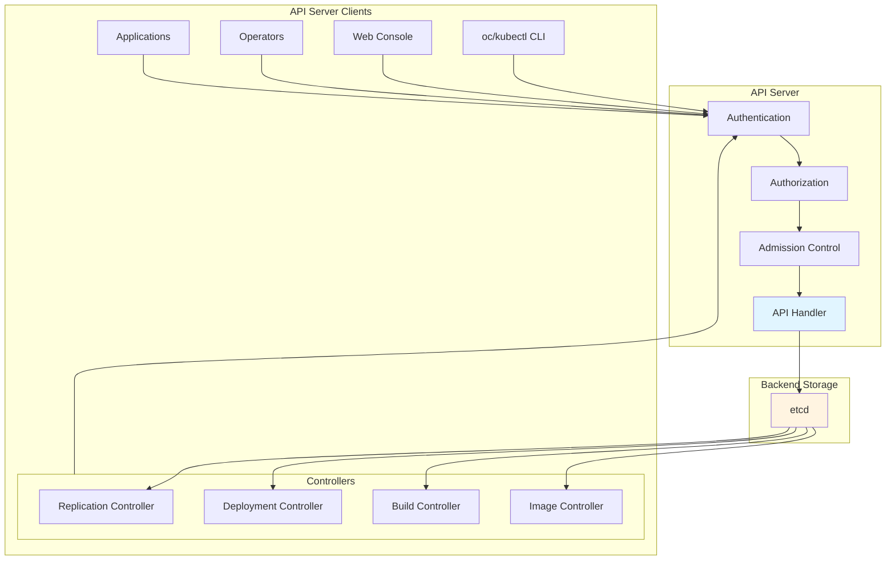
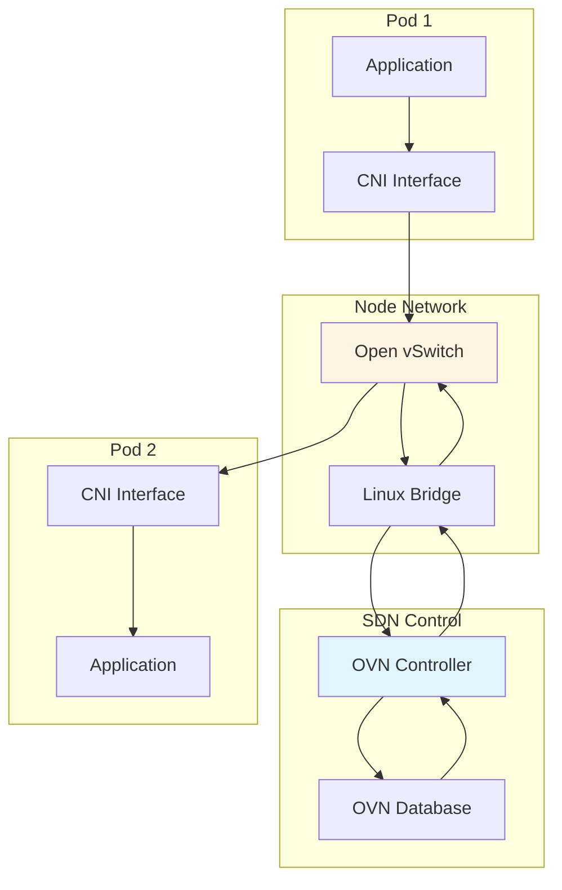
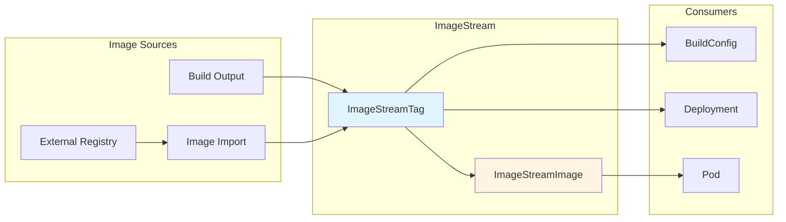
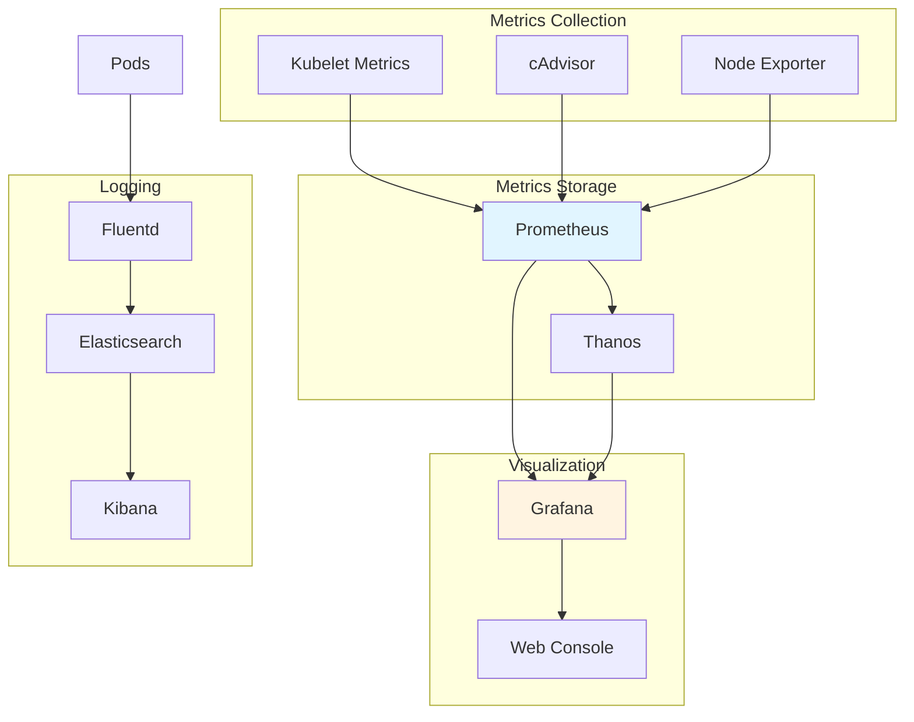
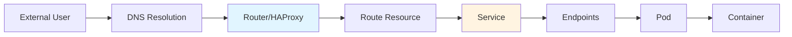
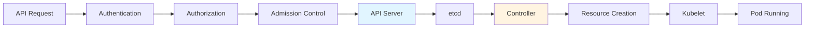
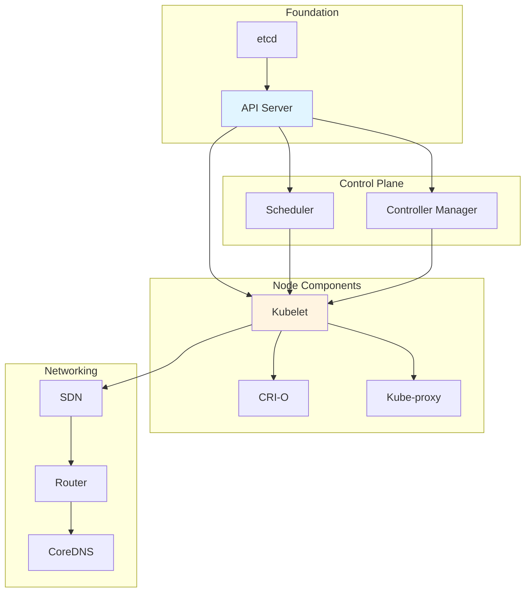

# OpenShift Component Interactions Guide

This guide explains how OpenShift components interact with each other and how to understand these interactions.

## Core Component Interactions

### API Server Interactions



### Controller Interactions

```mermaid
sequenceDiagram
    participant API as API Server
    participant etcd as etcd
    participant Controller as Controller
    participant Resource as Resource
    participant Kubelet as Kubelet
    
    API->>etcd: Store Resource
    etcd->>Controller: Watch Event
    Controller->>Controller: Reconcile Logic
    Controller->>API: Create/Update Resource
    API->>etcd: Store Change
    etcd->>Kubelet: Resource Assignment
    Kubelet->>Resource: Create/Update
    Resource->>Kubelet: Status Update
    Kubelet->>API: Update Status
    API->>etcd: Store Status
    etcd->>Controller: Status Event
    
    style Controller fill:#e1f5ff
    style etcd fill:#fff4e1
```

## Network Component Interactions

### Pod Networking Flow



### Service Discovery Interactions

```mermaid
sequenceDiagram
    participant Pod
    participant CoreDNS as CoreDNS
    participant Service as Service
    participant Endpoints as Endpoints Controller
    participant KubeProxy as Kube-proxy
    participant TargetPod as Target Pod
    
    Pod->>CoreDNS: DNS Query (svc.ns)
    CoreDNS->>Service: Resolve Service
    Service->>Endpoints: Get Endpoints
    Endpoints->>Service: Pod IPs
    Service->>CoreDNS: Service IP
    CoreDNS->>Pod: DNS Response (Service IP)
    Pod->>KubeProxy: Request to Service IP
    KubeProxy->>Endpoints: Get Pod IPs
    Endpoints->>KubeProxy: Pod IP List
    KubeProxy->>TargetPod: Forward to Pod
    TargetPod->>KubeProxy: Response
    KubeProxy->>Pod: Response
    
    style CoreDNS fill:#e1f5ff
    style KubeProxy fill:#fff4e1
```

## Build and Image Interactions

### Build Process Flow

```mermaid
sequenceDiagram
    participant User
    participant API as API Server
    participant BuildController as Build Controller
    participant BuildPod as Build Pod
    participant Registry as Image Registry
    participant ImageStream as ImageStream
    
    User->>API: Create BuildConfig
    API->>BuildController: BuildConfig Event
    BuildController->>API: Create Build
    API->>BuildController: Build Event
    BuildController->>API: Create Build Pod
    API->>BuildPod: Pod Assignment
    BuildPod->>BuildPod: Execute Build
    BuildPod->>Registry: Push Image
    Registry->>BuildPod: Push Confirmation
    BuildPod->>API: Update Build Status
    API->>ImageStream: Update ImageStream
    ImageStream->>API: ImageStream Updated
    
    style BuildController fill:#e1f5ff
    style BuildPod fill:#fff4e1
```

### Image Stream Interactions



## Deployment Interactions

### Deployment Flow

```mermaid
sequenceDiagram
    participant User
    participant API as API Server
    participant DeploymentController as Deployment Controller
    participant ReplicaSet as ReplicaSet
    participant Pod as Pod
    participant Kubelet as Kubelet
    
    User->>API: Create Deployment
    API->>DeploymentController: Deployment Event
    DeploymentController->>API: Create ReplicaSet
    API->>ReplicaSet: ReplicaSet Event
    ReplicaSet->>API: Create Pods
    API->>Kubelet: Pod Assignment
    Kubelet->>Pod: Start Pod
    Pod->>Kubelet: Running Status
    Kubelet->>API: Update Pod Status
    API->>ReplicaSet: Pod Status
    ReplicaSet->>API: ReplicaSet Status
    API->>DeploymentController: ReplicaSet Status
    DeploymentController->>API: Deployment Status
    
    style DeploymentController fill:#e1f5ff
    style ReplicaSet fill:#fff4e1
```

## Storage Interactions

### Volume Provisioning Flow

```mermaid
sequenceDiagram
    participant Pod
    participant API as API Server
    participant PVC as PVC Controller
    participant Provisioner as Storage Provisioner
    participant Storage as Storage Backend
    participant Kubelet as Kubelet
    
    Pod->>API: Create Pod with PVC
    API->>PVC: PVC Event
    PVC->>Provisioner: Provision Request
    Provisioner->>Storage: Create Volume
    Storage->>Provisioner: Volume Created
    Provisioner->>API: Update PVC
    API->>Kubelet: Pod with Volume
    Kubelet->>Storage: Mount Volume
    Storage->>Kubelet: Volume Mounted
    Kubelet->>Pod: Volume Available
    
    style Provisioner fill:#e1f5ff
    style Storage fill:#fff4e1
```

## Authentication and Authorization Flow

```mermaid
sequenceDiagram
    participant User
    participant OAuth as OAuth Server
    participant API as API Server
    participant RBAC as RBAC
    participant Resource as Resource
    
    User->>OAuth: Login Request
    OAuth->>OAuth: Authenticate
    OAuth->>User: Access Token
    User->>API: API Request + Token
    API->>OAuth: Validate Token
    OAuth->>API: Token Valid
    API->>RBAC: Check Permissions
    RBAC->>RBAC: Evaluate Rules
    RBAC->>API: Authorized
    API->>Resource: Process Request
    Resource->>API: Response
    API->>User: Response
    
    style OAuth fill:#e1f5ff
    style RBAC fill:#fff4e1
```

## Monitoring and Observability Interactions



## Understanding Data Flow

### Request Flow: External to Pod



### Control Flow: API to Resource



## Debugging Component Interactions

### Tracing a Request

```bash
# 1. Check external access
curl -v http://<route-host>

# 2. Check route
oc get route <route-name> -n <namespace> -o yaml

# 3. Check service
oc get service <service-name> -n <namespace> -o yaml

# 4. Check endpoints
oc get endpoints <service-name> -n <namespace> -o yaml

# 5. Check pod
oc get pod <pod-name> -n <namespace> -o yaml

# 6. Check pod logs
oc logs <pod-name> -n <namespace>

# 7. Check network from pod
oc exec <pod-name> -n <namespace> -- ip addr
oc exec <pod-name> -n <namespace> -- netstat -tulpn
```

### Tracing Resource Creation

```bash
# 1. Check resource
oc get <resource> <name> -n <namespace> -o yaml

# 2. Check events
oc get events -n <namespace> --field-selector involvedObject.name=<name>

# 3. Check controller logs
oc logs -n <controller-namespace> <controller-pod>

# 4. Check API server logs
oc logs -n openshift-kube-apiserver <api-server-pod>

# 5. Watch resource changes
oc get <resource> <name> -n <namespace> -w
```

## Component Dependency Map



## Best Practices for Understanding Interactions

1. **Follow the Data**: Trace data flow from source to destination
2. **Follow the Control**: Trace control flow from API to execution
3. **Use Events**: Events show component interactions
4. **Check Logs**: Logs at each layer show interactions
5. **Use Describe**: `oc describe` shows relationships
6. **Watch Resources**: Use `-w` to see interactions in real-time
7. **Check Dependencies**: Understand what each component depends on
8. **Map the Flow**: Draw diagrams to visualize interactions

