# GCP (Google Cloud Platform) Architecture

## Overview

This diagram provides a beginner-friendly view of how Google Cloud Platform (GCP) is structured and how its major services work together. The architecture is organized into logical layers that show the flow from users and applications down to the underlying infrastructure.

## Architecture Diagram

```mermaid
graph TB
    subgraph "User & Application Layer"
        Users[👥 Users]
        WebApp[🌐 Web Applications]
        MobileApp[📱 Mobile Apps]
        API[🔌 APIs]
    end

    subgraph "GCP Compute Layer"
        GCE[Compute Engine<br/>Virtual Machines<br/>Run applications on VMs]
        CloudFunctions[Cloud Functions<br/>Serverless Functions<br/>Event-driven code execution]
        GKE[GKE<br/>Google Kubernetes Engine<br/>Managed Kubernetes clusters]
        CloudRun[Cloud Run<br/>Serverless Containers<br/>Run containers without managing infrastructure]
        AppEngine[App Engine<br/>Fully Managed Platform<br/>Deploy applications without infrastructure management]
    end
    
    subgraph "GCP Networking Layer"
        VPC_GCP[VPC<br/>Virtual Private Cloud<br/>Isolated network environment]
        LoadBalancer[Cloud Load Balancing<br/>Traffic Distribution<br/>Distribute traffic across instances]
        CloudEndpoints[Cloud Endpoints<br/>API Management<br/>Create and manage APIs]
        CloudCDN[Cloud CDN<br/>Content Delivery Network<br/>Fast content delivery worldwide]
        CloudArmor[Cloud Armor<br/>DDoS Protection<br/>Protect against attacks]
    end
    
    subgraph "GCP Storage Layer"
        CloudStorage[Cloud Storage<br/>Object Storage<br/>Store files and media]
        PersistentDisk[Persistent Disk<br/>Block Storage<br/>Durable block storage for VMs]
        CloudSQL[Cloud SQL<br/>Managed SQL Databases<br/>MySQL, PostgreSQL, SQL Server]
        Firestore[Firestore<br/>NoSQL Database<br/>Flexible, scalable NoSQL database]
        Bigtable[Bigtable<br/>NoSQL Database<br/>Large-scale, low-latency database]
        Spanner[Cloud Spanner<br/>Globally Distributed SQL<br/>Horizontally scalable SQL database]
    end
    
    subgraph "GCP Security Layer"
        IAM_GCP[Cloud IAM<br/>Identity & Access Management<br/>Control access to resources]
        KMS_GCP[Cloud KMS<br/>Key Management Service<br/>Encryption key management]
        SecretManager[Secret Manager<br/>Store and manage secrets<br/>API keys, passwords, certificates]
        CloudArmor_Sec[Cloud Armor<br/>Web Application Firewall<br/>Protect web applications]
    end
    
    subgraph "GCP Operations Layer"
        Monitoring[Cloud Monitoring<br/>Metrics & Alerts<br/>Track performance and health]
        Logging[Cloud Logging<br/>Centralized Logging<br/>Collect and analyze logs]
        Trace[Cloud Trace<br/>Distributed Tracing<br/>Trace requests across services]
        CloudBuild[Cloud Build<br/>CI/CD Pipeline<br/>Build, test, and deploy]
        CloudDeploy[Cloud Deploy<br/>Continuous Delivery<br/>Automated deployment to GKE]
    end

    subgraph "GCP Infrastructure Layer"
        Regions_GCP[🌍 Regions<br/>Geographic locations<br/>e.g., us-central1, europe-west1]
        Zones[Zones<br/>Isolated data centers<br/>For high availability]
        DataCenters_GCP[🏢 Data Centers<br/>Physical infrastructure<br/>Servers and networking]
    end

    %% User to Application connections
    Users --> WebApp
    Users --> MobileApp
    WebApp --> API
    MobileApp --> API

    %% Application to GCP connections
    API --> CloudEndpoints
    CloudEndpoints --> LoadBalancer
    LoadBalancer --> GCE
    LoadBalancer --> GKE
    LoadBalancer --> CloudRun
    LoadBalancer --> AppEngine
    CloudEndpoints --> CloudFunctions
    CloudCDN --> CloudStorage
    CloudCDN --> LoadBalancer

    %% Networking connections
    GCE --> VPC_GCP
    CloudFunctions --> VPC_GCP
    GKE --> VPC_GCP
    CloudRun --> VPC_GCP
    AppEngine --> VPC_GCP
    CloudSQL --> VPC_GCP
    LoadBalancer --> CloudArmor

    %% Storage connections
    GCE --> PersistentDisk
    GCE --> CloudStorage
    GKE --> CloudSQL
    GKE --> Firestore
    CloudRun --> CloudSQL
    CloudFunctions --> Firestore
    CloudFunctions --> CloudStorage
    AppEngine --> CloudSQL
    WebApp --> CloudStorage

    %% Security connections
    GCE --> IAM_GCP
    CloudFunctions --> IAM_GCP
    GKE --> IAM_GCP
    CloudRun --> IAM_GCP
    AppEngine --> IAM_GCP
    CloudStorage --> KMS_GCP
    CloudSQL --> KMS_GCP
    PersistentDisk --> KMS_GCP
    CloudFunctions --> SecretManager
    GCE --> SecretManager

    %% Operations connections
    GCE --> Monitoring
    CloudFunctions --> Monitoring
    GKE --> Monitoring
    CloudRun --> Monitoring
    AppEngine --> Monitoring
    CloudSQL --> Monitoring
    GCE --> Logging
    CloudFunctions --> Logging
    GKE --> Logging
    CloudRun --> Logging
    CloudStorage --> Logging
    CloudFunctions --> Trace
    GKE --> Trace
    CloudRun --> Trace
    CloudBuild --> GKE
    CloudBuild --> CloudRun
    CloudBuild --> AppEngine
    CloudDeploy --> GKE

    %% Infrastructure connections
    VPC_GCP --> Regions_GCP
    GCE --> Zones
    GKE --> Zones
    CloudSQL --> Zones
    Zones --> Regions_GCP
    Regions_GCP --> DataCenters_GCP

    style Users fill:#e1f5ff
    style WebApp fill:#e1f5ff
    style MobileApp fill:#e1f5ff
    style API fill:#e1f5ff
    style GCE fill:#4285f4
    style CloudFunctions fill:#4285f4
    style GKE fill:#4285f4
    style CloudRun fill:#4285f4
    style AppEngine fill:#4285f4
    style CloudStorage fill:#4285f4
    style CloudSQL fill:#4285f4
    style IAM_GCP fill:#4285f4
    style Monitoring fill:#4285f4
    style VPC_GCP fill:#4285f4
    style DataCenters_GCP fill:#f0f0f0
    style Regions_GCP fill:#f0f0f0
    style Zones fill:#f0f0f0
```

## Architecture Layers Explained

### 1. User & Application Layer
This is where end users interact with applications through web browsers, mobile apps, or API clients. Applications at this layer make requests to backend services hosted on Google Cloud Platform.

### 2. Compute Layer
**Purpose**: Provides the processing power to run applications and services.

- **Compute Engine**: Virtual machines (VMs) that you can configure and manage. Similar to having your own server in the cloud.
- **Cloud Functions**: Serverless functions that run code in response to events. Pay only for execution time, scales automatically.
- **GKE (Google Kubernetes Engine)**: Fully managed Kubernetes service for running containerized applications. Google invented Kubernetes.
- **Cloud Run**: Serverless container platform. Deploy containers that automatically scale to zero when not in use.
- **App Engine**: Fully managed platform-as-a-service (PaaS). Deploy applications without managing infrastructure.

**How it works**: Applications are deployed to these compute resources, which can scale up or down based on demand. Compute Engine gives you full control, while App Engine, Cloud Run, and Cloud Functions provide more managed options with less operational overhead.

### 3. Networking Layer
**Purpose**: Connects services, routes traffic, and provides secure communication.

- **VPC (Virtual Private Cloud)**: Your own isolated network in GCP. Global by default, allowing resources across regions to communicate.
- **Cloud Load Balancing**: Distributes incoming traffic across multiple instances. Supports HTTP(S), TCP, UDP, and internal load balancing.
- **Cloud Endpoints**: API management platform that helps you create, deploy, and manage APIs. Provides API analytics and developer portal.
- **Cloud CDN**: Content Delivery Network that caches content at Google's edge locations worldwide for faster delivery.
- **Cloud Armor**: DDoS protection and web application firewall (WAF) service that protects your applications.

**How it works**: Traffic flows from users through Cloud Endpoints and load balancers to the appropriate compute resources. VPC provides network isolation, and Cloud CDN caches content globally. Cloud Armor protects against attacks.

### 4. Storage Layer
**Purpose**: Stores data persistently for applications and users.

- **Cloud Storage**: Object storage for files, images, videos, backups. Highly durable, scalable, and cost-effective.
- **Persistent Disk**: Block storage volumes attached to Compute Engine VMs. Like a hard drive for your virtual machine.
- **Cloud SQL**: Fully managed relational database service supporting MySQL, PostgreSQL, and SQL Server. Handles backups, replication, and scaling.
- **Firestore**: Flexible, scalable NoSQL database. Real-time updates and automatic scaling.
- **Bigtable**: NoSQL database for large-scale, low-latency workloads. Used by many Google services internally.
- **Cloud Spanner**: Globally distributed, horizontally scalable SQL database. Combines benefits of SQL and NoSQL.

**How it works**: Applications read and write data to storage services. Cloud Storage is for files and static content, Persistent Disk is for databases on VMs, Cloud SQL is for managed SQL databases, and Firestore/Bigtable/Spanner are for NoSQL needs at different scales.

### 5. Security Layer
**Purpose**: Protects resources, manages access, and encrypts data.

- **Cloud IAM**: Controls who can access GCP resources and what they can do. Defines users, service accounts, roles, and policies.
- **Cloud KMS**: Creates and manages encryption keys used to encrypt your data at rest and in transit.
- **Secret Manager**: Securely stores and manages secrets like API keys, passwords, and certificates. Provides versioning and access logging.
- **Cloud Armor**: Web application firewall that protects against DDoS attacks and common web exploits.

**How it works**: Cloud IAM controls access to all GCP resources. Cloud KMS manages encryption keys for data protection. Secret Manager keeps sensitive information secure. Cloud Armor protects web applications from attacks.

### 6. Operations Layer
**Purpose**: Monitors system health, logs events, and automates deployments.

- **Cloud Monitoring**: Monitors GCP resources and applications. Collects metrics, creates dashboards, and sets up alerts.
- **Cloud Logging**: Centralized logging service that collects logs from GCP services and your applications. Provides search and analysis.
- **Cloud Trace**: Distributed tracing system that helps you understand how requests flow through your distributed applications.
- **Cloud Build**: Continuous integration and deployment service. Builds, tests, and deploys applications automatically.
- **Cloud Deploy**: Continuous delivery service specifically for deploying to GKE clusters.

**How it works**: Cloud Monitoring tracks performance and alerts on issues. Cloud Logging collects and analyzes logs from all services. Cloud Trace helps debug distributed systems. Cloud Build and Cloud Deploy automate the CI/CD process.

### 7. Infrastructure Layer
**Purpose**: The physical foundation - data centers and geographic distribution.

- **Regions**: Geographic locations where GCP has data centers (e.g., us-central1 in Iowa, europe-west1 in Belgium).
- **Zones**: Isolated data centers within a region. Each region has multiple zones for redundancy and high availability.
- **Data Centers**: Physical facilities housing servers, networking equipment, and storage systems. Google's global network connects them.

**How it works**: GCP operates globally with regions and zones. Deploying across multiple zones provides high availability. Google's private network connects all data centers for fast, secure communication.

## Key Data Flows

### 1. User Request Flow
1. User makes a request through a web or mobile app
2. Request may go through Cloud CDN for cached content
3. Request reaches Cloud Endpoints which routes to appropriate services
4. Cloud Endpoints forwards to Cloud Load Balancing
5. Load balancer distributes traffic to available Compute Engine VMs, GKE pods, or Cloud Run containers
6. Application processes the request, potentially accessing Cloud Storage, Cloud SQL, or Firestore
7. Response flows back through the same path to the user

### 2. Application Deployment Flow
1. Developer commits code to a repository (GitHub, Cloud Source Repositories)
2. Cloud Build detects the change and triggers a build
3. Cloud Build compiles the code, runs tests, builds container images, and stores them in Container Registry or Artifact Registry
4. Cloud Build or Cloud Deploy deploys the application to GKE, Cloud Run, or App Engine
5. Cloud Monitoring monitors the deployment and application health
6. If issues occur, Cloud Monitoring triggers alerts and can trigger rollback

### 3. Data Storage Flow
1. Application writes data to storage service (Cloud Storage, Cloud SQL, Firestore)
2. Data is encrypted using keys from Cloud KMS
3. Data is replicated across multiple zones automatically
4. Access is controlled through Cloud IAM policies
5. All access is logged in Cloud Logging for audit purposes
6. Backups are automatically created (for Cloud SQL) or can be versioned (for Cloud Storage)

### 4. Auto-Scaling Flow
1. Cloud Monitoring monitors metrics (CPU, memory, request count, custom metrics)
2. When thresholds are exceeded, auto-scaling policies trigger
3. New Compute Engine instances, GKE pods, or Cloud Run containers are launched
4. Load balancer automatically includes new instances in the pool
5. Traffic is distributed across all instances
6. When load decreases, extra instances are terminated (Cloud Run can scale to zero)

## Common Use Cases

### Web Application
- **Frontend**: Static files served via Cloud Storage + Cloud CDN
- **Backend API**: Runs on Compute Engine VMs, GKE, or Cloud Run
- **Load Balancing**: Cloud Load Balancing distributes traffic across backend instances
- **Database**: Cloud SQL for SQL data, Firestore for NoSQL needs
- **Storage**: Cloud Storage for user uploads and media files
- **Security**: Cloud Armor protects against attacks, Cloud IAM controls access

### Microservices Architecture
- **Cloud Endpoints**: Routes requests to appropriate microservices
- **Services**: Each microservice runs in GKE containers or Cloud Run
- **Service Mesh**: Use Anthos Service Mesh or Istio for advanced traffic management
- **Databases**: Each service may have its own Cloud SQL or Firestore collection
- **Monitoring**: Cloud Monitoring tracks each service, Cloud Trace traces requests across services

### Serverless Application
- **Cloud Endpoints**: Entry point for HTTP requests
- **Cloud Functions**: Execute business logic without managing servers
- **Cloud Run**: Run containers serverlessly with automatic scaling
- **Firestore**: Store data with automatic scaling
- **Cloud Storage**: Store static assets and trigger Cloud Functions on file uploads
- **Event-Driven**: Functions respond to events (HTTP requests, Cloud Storage changes, Pub/Sub messages)

## Security Best Practices

1. **Network Isolation**: Use VPCs to create isolated network environments. Use private IP addresses for internal communication.
2. **Identity Management**: Use service accounts for applications instead of user accounts. Follow principle of least privilege with Cloud IAM.
3. **Encryption**: Enable encryption at rest (using Cloud KMS) and in transit (using SSL/TLS). Encrypt Persistent Disks and Cloud Storage buckets.
4. **Firewalls**: Use VPC firewall rules to restrict access. Use Cloud Armor for web application protection.
5. **Audit Logging**: Enable Cloud Audit Logs for all services. Monitor logs for suspicious activity.
6. **Secrets Management**: Store secrets in Secret Manager, not in code or configuration files.
7. **DDoS Protection**: Use Cloud Armor for DDoS protection and WAF capabilities.

## Monitoring & Observability

- **Cloud Monitoring Metrics**: Track CPU, memory, network, disk, and custom metrics from your applications
- **Cloud Logging**: Centralized logging from Compute Engine, Cloud Functions, GKE, and other services
- **Cloud Monitoring Alerts**: Get notified when metrics exceed thresholds via email, SMS, or PagerDuty
- **Cloud Monitoring Dashboards**: Visualize metrics and logs in custom dashboards
- **Cloud Trace**: Trace requests across distributed services to identify bottlenecks and errors
- **Cloud Profiler**: Analyze application performance to identify optimization opportunities

## Cost Optimization Tips

1. **Right-Sizing**: Choose appropriate machine types. Use Cloud Monitoring to identify underutilized resources.
2. **Committed Use Discounts**: Purchase committed use contracts for predictable workloads (up to 70% savings).
3. **Preemptible VMs**: Use preemptible VMs for fault-tolerant workloads (up to 80% savings).
4. **Auto Scaling**: Automatically scale down during low-traffic periods. Cloud Run scales to zero automatically.
5. **Cloud Storage Lifecycle Policies**: Move old data to cheaper storage classes (Nearline, Coldline, Archive).
6. **Cloud Functions/Cloud Run**: Use serverless options for short-running tasks instead of always-on VMs.

## Summary

Google Cloud Platform provides a comprehensive cloud platform organized into clear layers:

1. **Users** interact with applications
2. **Applications** run on compute resources (Compute Engine, Cloud Functions, GKE, Cloud Run, App Engine)
3. **Networking** (VPC, Load Balancing, Cloud Endpoints, Cloud CDN) routes and balances traffic
4. **Storage** (Cloud Storage, Persistent Disk, Cloud SQL, Firestore, Bigtable, Spanner) persists data
5. **Security** (Cloud IAM, Cloud KMS, Secret Manager, Cloud Armor) protects everything
6. **Operations** (Cloud Monitoring, Cloud Logging, Cloud Trace, Cloud Build) monitors and automates
7. **Infrastructure** (Regions, Zones) provides global, resilient foundation

GCP services are designed to work together seamlessly, with built-in integrations and best practices for security, scalability, and reliability. The platform leverages Google's expertise in distributed systems, data analytics, and machine learning, making it particularly strong for data-intensive and AI/ML workloads.

