# Kubernetes Component Interactions Guide

This guide explains how Kubernetes components interact with each other and how to understand these interactions.

## Core Component Interactions

### API Server Interactions

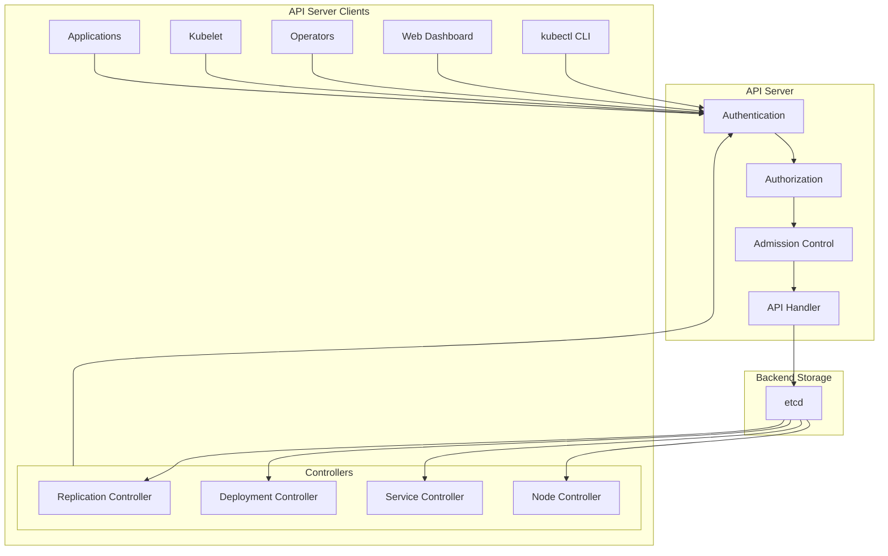

### Controller Interactions

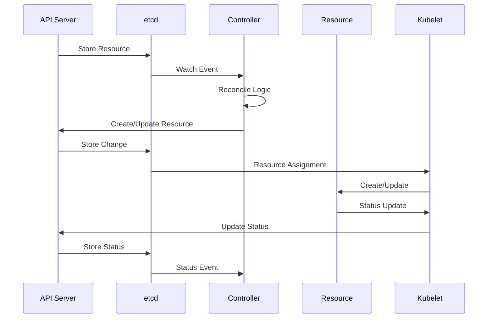

## Pod Lifecycle Interactions

### Pod Creation Flow

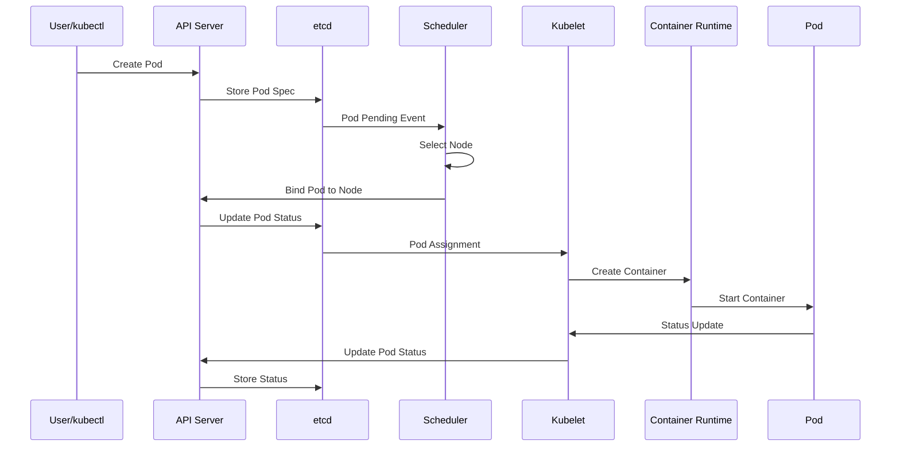

### Pod Deletion Flow

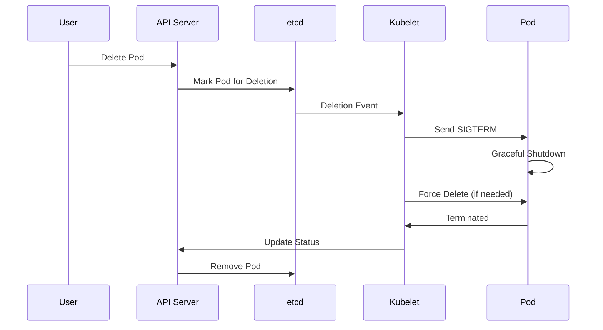

## Deployment Interactions

### Deployment Update Flow

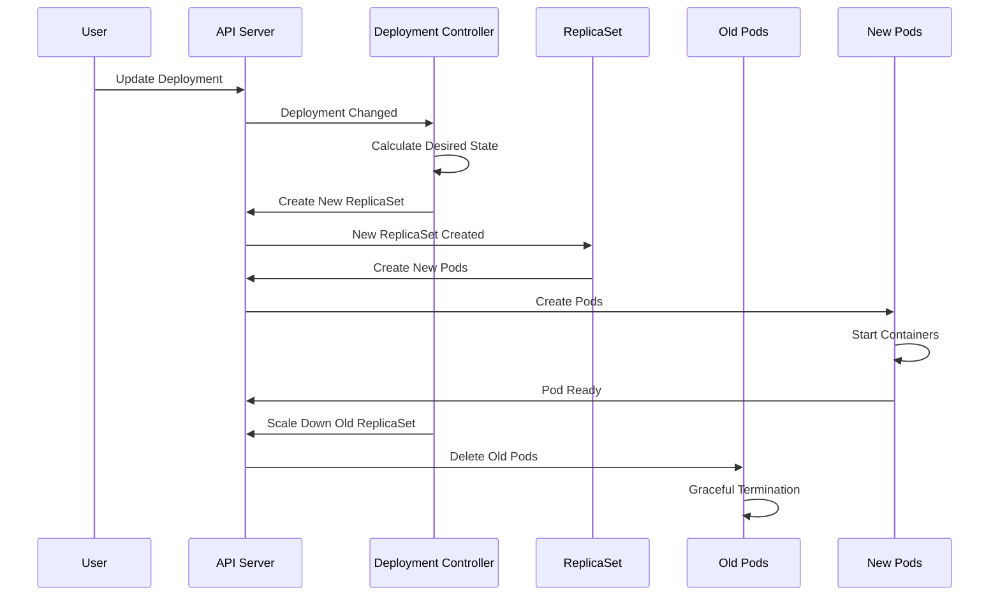

## Service Discovery Interactions

### Service and Endpoints

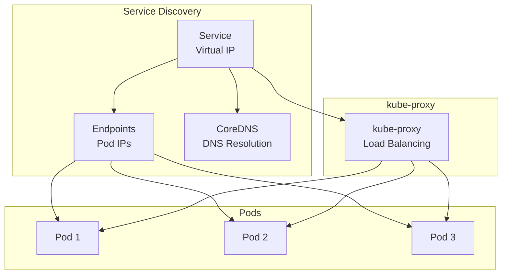

### DNS Resolution Flow

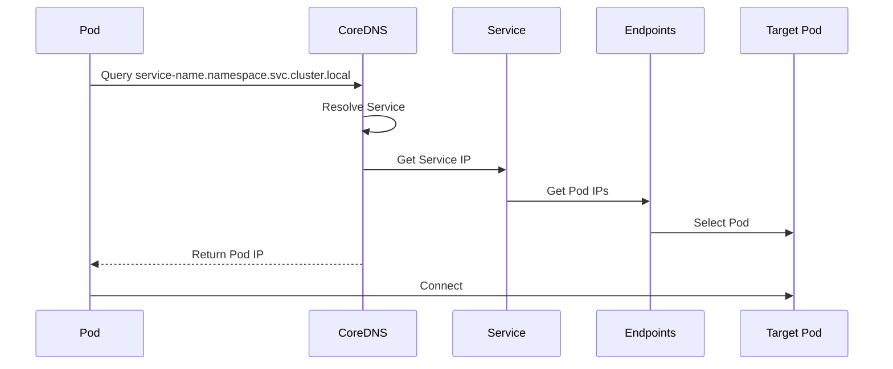

## Networking Interactions

### Pod-to-Pod Communication

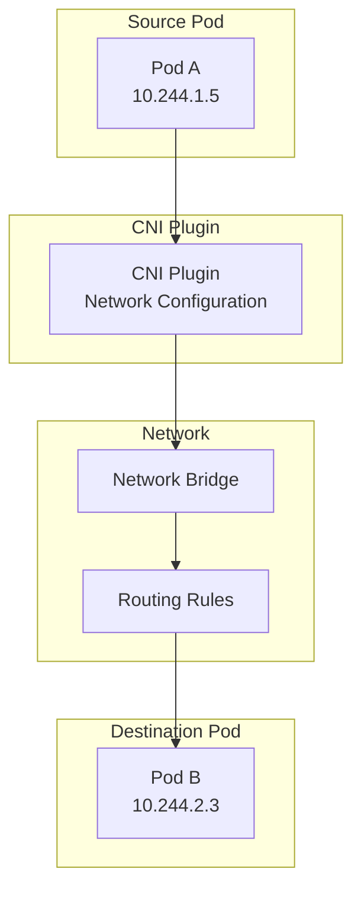

### Ingress Flow

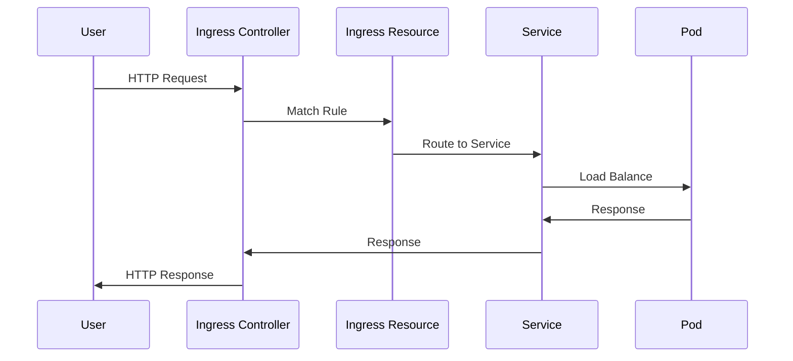

## Storage Interactions

### Persistent Volume Flow

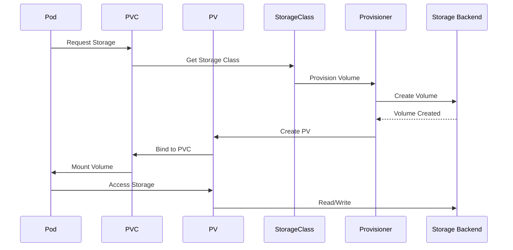

## Scheduler Interactions

### Pod Scheduling Flow

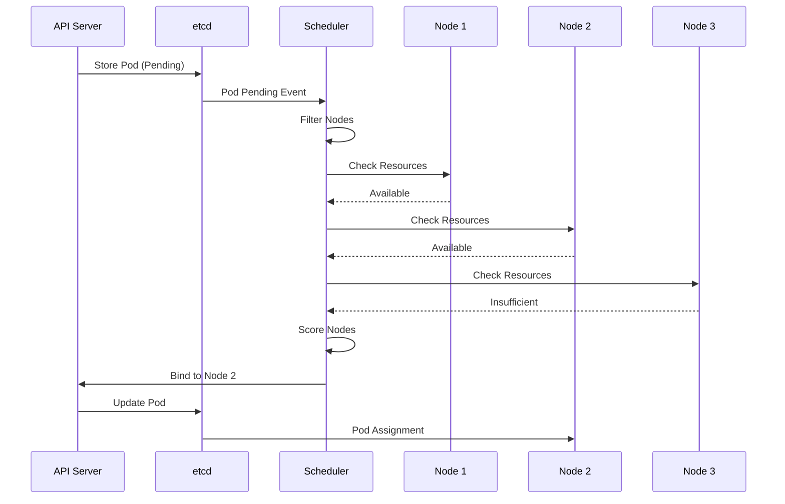

## Health Check Interactions

### Liveness and Readiness Probes

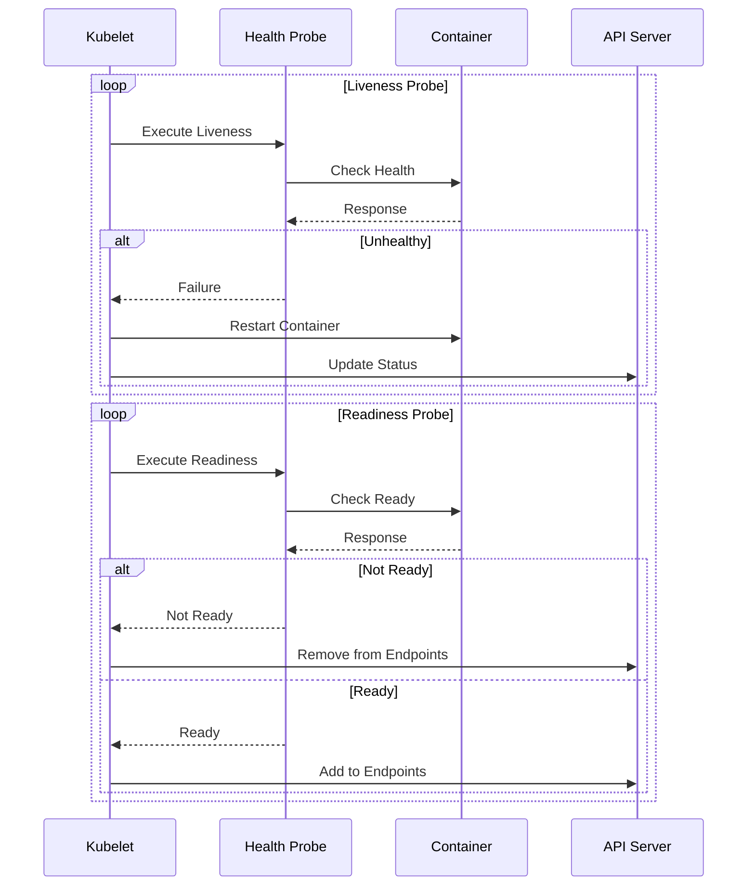

## Autoscaling Interactions

### Horizontal Pod Autoscaler

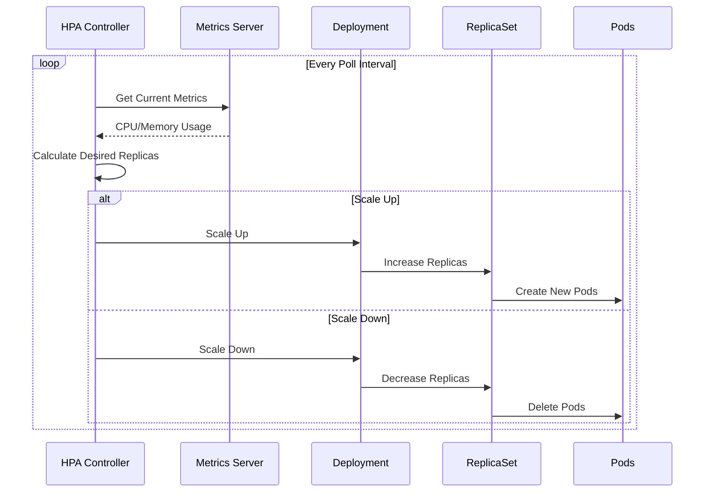

## Security Interactions

### RBAC Flow

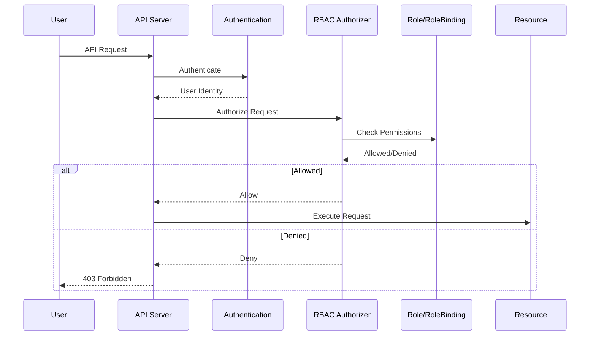

## Summary

Kubernetes components interact through well-defined patterns:

1. **Event-Driven**: Components react to changes in etcd
2. **Watch Loops**: Controllers watch resources and reconcile state
3. **API-Centric**: All interactions go through the API Server
4. **Declarative**: Desired state is declared, actual state is reconciled
5. **Asynchronous**: Many operations are asynchronous with status updates
6. **Layered**: Clear separation between control plane and data plane

Understanding these interaction patterns helps with:
- **Debugging**: Knowing which component to check when issues occur
- **Troubleshooting**: Tracing issues through the component flow
- **Architecture**: Designing applications that work well with Kubernetes
- **Operations**: Understanding how to monitor and maintain clusters

