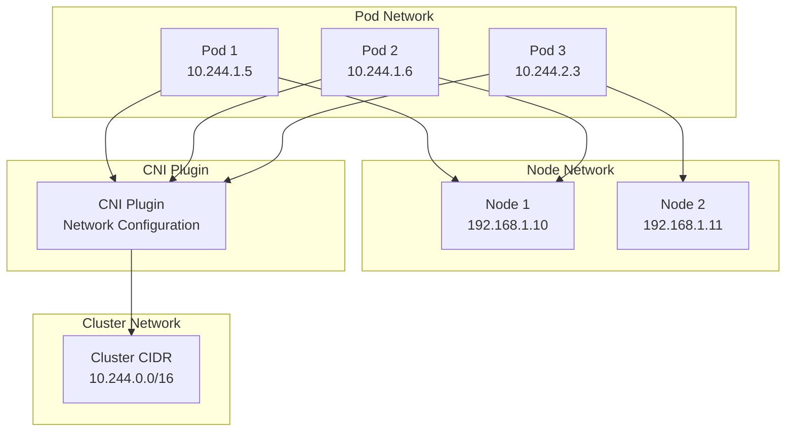
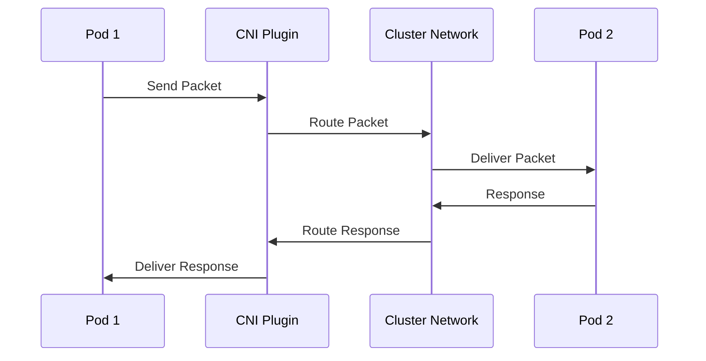
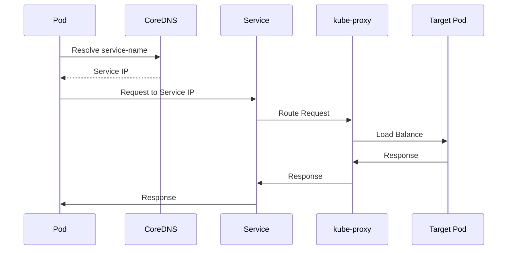
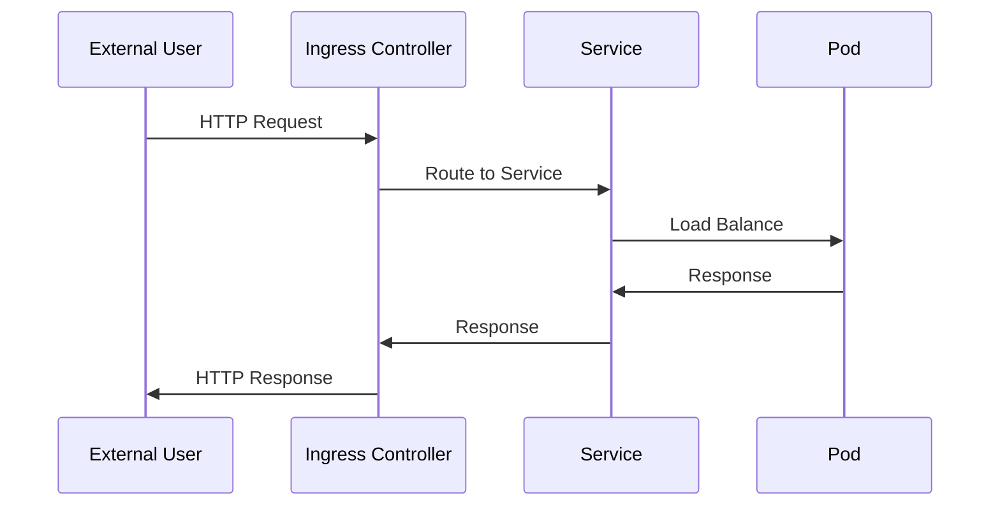

# Kubernetes Network and API Guide

This guide explains Kubernetes networking architecture, API structure, and communication patterns.

## Networking Architecture

### Pod Networking Model



### Network Components

1. **Pod Network**: Each pod gets its own IP address
2. **Service Network**: Virtual IPs for services
3. **Node Network**: Physical/Virtual network between nodes
4. **CNI Plugin**: Configures pod networking
5. **kube-proxy**: Manages service networking and load balancing

## Service Types

### ClusterIP (Default)

```yaml
apiVersion: v1
kind: Service
metadata:
  name: my-service
spec:
  type: ClusterIP
  selector:
    app: my-app
  ports:
  - port: 80
    targetPort: 8080
```

**Characteristics:**
- Internal cluster IP
- Accessible only within cluster
- Stable virtual IP
- Load balances to pods

### NodePort

```yaml
apiVersion: v1
kind: Service
metadata:
  name: my-service
spec:
  type: NodePort
  selector:
    app: my-app
  ports:
  - port: 80
    targetPort: 8080
    nodePort: 30080
```

**Characteristics:**
- Exposes service on each node's IP
- Accessible from outside cluster
- Port range: 30000-32767
- Routes to ClusterIP

### LoadBalancer

```yaml
apiVersion: v1
kind: Service
metadata:
  name: my-service
spec:
  type: LoadBalancer
  selector:
    app: my-app
  ports:
  - port: 80
    targetPort: 8080
```

**Characteristics:**
- Cloud provider load balancer
- External IP address
- Routes to NodePort/ClusterIP
- Requires cloud provider support

### ExternalName

```yaml
apiVersion: v1
kind: Service
metadata:
  name: my-service
spec:
  type: ExternalName
  externalName: my-external-service.com
```

**Characteristics:**
- Maps to external DNS name
- No selector or endpoints
- DNS CNAME record
- Used for external services

## Ingress

### Basic Ingress

```yaml
apiVersion: networking.k8s.io/v1
kind: Ingress
metadata:
  name: my-ingress
spec:
  rules:
  - host: myapp.example.com
    http:
      paths:
      - path: /
        pathType: Prefix
        backend:
          service:
            name: my-service
            port:
              number: 80
```

### Ingress with TLS

```yaml
apiVersion: networking.k8s.io/v1
kind: Ingress
metadata:
  name: my-ingress
spec:
  tls:
  - hosts:
    - myapp.example.com
    secretName: tls-secret
  rules:
  - host: myapp.example.com
    http:
      paths:
      - path: /
        pathType: Prefix
        backend:
          service:
            name: my-service
            port:
              number: 80
```

## Network Policies

### Basic Network Policy

```yaml
apiVersion: networking.k8s.io/v1
kind: NetworkPolicy
metadata:
  name: allow-app
spec:
  podSelector:
    matchLabels:
      app: my-app
  policyTypes:
  - Ingress
  - Egress
  ingress:
  - from:
    - podSelector:
        matchLabels:
          app: frontend
    ports:
    - protocol: TCP
      port: 8080
  egress:
  - to:
    - podSelector:
        matchLabels:
          app: database
    ports:
    - protocol: TCP
      port: 5432
```

## DNS and Service Discovery

### DNS Structure

```
<service-name>.<namespace>.svc.cluster.local
```

**Examples:**
- `my-service.default.svc.cluster.local`
- `my-service` (short form, same namespace)
- `my-service.other-namespace` (cross-namespace)

### CoreDNS Configuration

```yaml
apiVersion: v1
kind: ConfigMap
metadata:
  name: coredns
  namespace: kube-system
data:
  Corefile: |
    .:53 {
        errors
        health
        kubernetes cluster.local in-addr.arpa ip6.arpa {
            pods insecure
            upstream
            fallthrough in-addr.arpa ip6.arpa
        }
        prometheus :9153
        forward . /etc/resolv.conf
        cache 30
        loop
        reload
        loadbalance
    }
```

## API Structure

### API Groups

Kubernetes APIs are organized into groups:

- **Core API**: `/api/v1` (pods, services, configmaps, etc.)
- **Apps API**: `/apis/apps/v1` (deployments, replicasets, etc.)
- **Networking API**: `/apis/networking.k8s.io/v1` (ingress, networkpolicies)
- **Storage API**: `/apis/storage.k8s.io/v1` (storageclasses, volumes)
- **RBAC API**: `/apis/rbac.authorization.k8s.io/v1` (roles, rolebindings)

### API Resources

```yaml
apiVersion: apps/v1        # API Group and Version
kind: Deployment          # Resource Type
metadata:
  name: my-deployment     # Resource Name
  namespace: default      # Namespace
spec:                     # Desired State
  replicas: 3
  selector:
    matchLabels:
      app: my-app
  template:
    metadata:
      labels:
        app: my-app
    spec:
      containers:
      - name: my-container
        image: nginx:latest
status:                    # Actual State (read-only)
  replicas: 3
  readyReplicas: 3
```

### API Operations

**Create:**
```bash
kubectl create -f resource.yaml
# POST /api/v1/namespaces/{namespace}/pods
```

**Get:**
```bash
kubectl get pod my-pod
# GET /api/v1/namespaces/{namespace}/pods/{name}
```

**Update:**
```bash
kubectl apply -f resource.yaml
# PUT /api/v1/namespaces/{namespace}/pods/{name}
```

**Delete:**
```bash
kubectl delete pod my-pod
# DELETE /api/v1/namespaces/{namespace}/pods/{name}
```

**Watch:**
```bash
kubectl get pods --watch
# GET /api/v1/namespaces/{namespace}/pods?watch=true
```

## API Server Communication

### Authentication

**Service Account Token:**
```yaml
apiVersion: v1
kind: ServiceAccount
metadata:
  name: my-sa
---
apiVersion: v1
kind: Pod
spec:
  serviceAccountName: my-sa
  containers:
  - name: my-container
    image: my-image
```

**kubectl Config:**
```yaml
apiVersion: v1
kind: Config
clusters:
- cluster:
    server: https://kubernetes:6443
    certificate-authority-data: <cert>
  name: my-cluster
contexts:
- context:
    cluster: my-cluster
    user: my-user
  name: my-context
users:
- name: my-user
  user:
    client-certificate-data: <cert>
    client-key-data: <key>
```

### Authorization

**RBAC Example:**
```yaml
apiVersion: rbac.authorization.k8s.io/v1
kind: Role
metadata:
  name: pod-reader
rules:
- apiGroups: [""]
  resources: ["pods"]
  verbs: ["get", "watch", "list"]
---
apiVersion: rbac.authorization.k8s.io/v1
kind: RoleBinding
metadata:
  name: read-pods
subjects:
- kind: User
  name: jane
  apiGroup: rbac.authorization.k8s.io
roleRef:
  kind: Role
  name: pod-reader
  apiGroup: rbac.authorization.k8s.io
```

## Network Communication Patterns

### Pod-to-Pod Communication



### Pod-to-Service Communication



### External Access Flow



## Network Troubleshooting

### Common Commands

```bash
# Check pod IP
kubectl get pod -o wide

# Check service endpoints
kubectl get endpoints my-service

# Check DNS resolution
kubectl run -it --rm debug --image=busybox --restart=Never -- nslookup my-service

# Check network policies
kubectl get networkpolicies

# Check kube-proxy
kubectl get pods -n kube-system -l k8s-app=kube-proxy

# Check CoreDNS
kubectl get pods -n kube-system -l k8s-app=kube-dns
```

### Network Debugging

```bash
# Test connectivity from pod
kubectl exec -it my-pod -- ping other-pod-ip

# Check service connectivity
kubectl exec -it my-pod -- curl http://my-service:80

# View iptables rules (kube-proxy)
iptables -t nat -L

# Check CNI configuration
cat /etc/cni/net.d/*.conf
```

## Best Practices

### Service Design

1. **Use ClusterIP for internal services**
2. **Use NodePort for development/testing**
3. **Use LoadBalancer for production external access**
4. **Use Ingress for HTTP/HTTPS routing**
5. **Label services consistently**

### Network Policies

1. **Default deny, explicit allow**
2. **Use namespaces for isolation**
3. **Test policies in non-production first**
4. **Document policy requirements**

### DNS

1. **Use service names, not IPs**
2. **Use FQDNs for cross-namespace access**
3. **Monitor CoreDNS performance**
4. **Configure DNS caching appropriately**

## Additional Resources

- [Kubernetes Networking](https://kubernetes.io/docs/concepts/cluster-administration/networking/)
- [Service Documentation](https://kubernetes.io/docs/concepts/services-networking/service/)
- [Ingress Documentation](https://kubernetes.io/docs/concepts/services-networking/ingress/)
- [Network Policies](https://kubernetes.io/docs/concepts/services-networking/network-policies/)

