# Kubernetes Architecture

## Overview

This diagram provides a beginner-friendly view of how Kubernetes is structured and how its major components work together. The architecture is organized into logical layers that show the flow from users and applications down to the underlying infrastructure. Kubernetes is a container orchestration platform that automates the deployment, scaling, and management of containerized applications.

## Architecture Diagram

```mermaid
graph TB
    subgraph "User & Developer Layer"
        Users[👥 Users<br/>End users accessing applications]
        Developers[👨‍💻 Developers<br/>Build and deploy applications]
        CI_CD[🔄 CI/CD Pipelines<br/>Automated build and deployment<br/>Jenkins, GitLab CI, GitHub Actions]
        kubectl[kubectl<br/>Command-line tool<br/>Interact with Kubernetes cluster]
    end

    subgraph "Application Layer"
        Pods[📦 Pods<br/>Smallest deployable unit<br/>Contains one or more containers]
        Containers[🐳 Containers<br/>Application runtime<br/>Docker, containerd, CRI-O]
        Deployments[📋 Deployments<br/>Manage replica sets<br/>Declarative updates and rollbacks]
        StatefulSets[💾 StatefulSets<br/>Stateful applications<br/>Databases, message queues]
        DaemonSets[⚙️ DaemonSets<br/>Node-level services<br/>Logging, monitoring agents]
        Jobs[📝 Jobs<br/>One-time tasks<br/>Batch processing, data migration]
    end

    subgraph "Control Plane Layer"
        API_Server[🌐 API Server<br/>Kubernetes brain<br/>Validates and processes requests]
        etcd[💿 etcd<br/>Cluster state database<br/>Stores all cluster data]
        Scheduler[📅 Scheduler<br/>Pod placement<br/>Assigns pods to nodes]
        Controller_Manager[🎛️ Controller Manager<br/>Cluster controllers<br/>Maintains desired state]
        Cloud_Controller[☁️ Cloud Controller<br/>Cloud integration<br/>Load balancers, volumes]
    end

    subgraph "Networking Layer"
        Services[🔌 Services<br/>Network abstraction<br/>Expose pods with stable IP]
        Ingress[🚪 Ingress<br/>External access<br/>HTTP/HTTPS routing]
        Ingress_Controller[🎚️ Ingress Controller<br/>Traffic routing<br/>NGINX, Traefik, Istio]
        CNI[🌐 CNI<br/>Container Network Interface<br/>Pod networking plugin]
        DNS[🔍 CoreDNS<br/>Service discovery<br/>DNS for services and pods]
    end

    subgraph "Worker Node Layer"
        Kubelet[🤖 Kubelet<br/>Node agent<br/>Manages pods on node]
        Kube_Proxy[🔄 kube-proxy<br/>Network proxy<br/>Service load balancing]
        Container_Runtime[🐳 Container Runtime<br/>Runs containers<br/>Docker, containerd, CRI-O]
        Node[🖥️ Worker Node<br/>Physical/Virtual machine<br/>Runs application workloads]
    end

    subgraph "Storage Layer"
        Volumes[💿 Volumes<br/>Pod storage<br/>Temporary or persistent]
        PV[📦 Persistent Volumes<br/>Cluster storage<br/>Storage abstraction]
        PVC[📋 Persistent Volume Claims<br/>Storage requests<br/>Pods request storage]
        Storage_Class[🗂️ Storage Classes<br/>Storage types<br/>SSD, HDD, network storage]
        CSI[💾 CSI<br/>Container Storage Interface<br/>Storage plugin system]
    end

    subgraph "Security Layer"
        RBAC[🔐 RBAC<br/>Role-Based Access Control<br/>User and service permissions]
        Secrets[🔑 Secrets<br/>Sensitive data<br/>Passwords, tokens, keys]
        ConfigMaps[📄 ConfigMaps<br/>Configuration data<br/>Non-sensitive config]
        Network_Policies[🛡️ Network Policies<br/>Network security<br/>Control pod communication]
        Pod_Security[🔒 Pod Security<br/>Security standards<br/>Enforce security policies]
    end

    subgraph "Observability Layer"
        Metrics[📊 Metrics<br/>Performance data<br/>CPU, memory, network]
        Logs[📝 Logs<br/>Application logs<br/>Container stdout/stderr]
        Tracing[🔍 Tracing<br/>Request tracing<br/>Distributed tracing]
        Prometheus[📈 Prometheus<br/>Metrics collection<br/>Time-series database]
        Grafana[📊 Grafana<br/>Visualization<br/>Dashboards and alerts]
        Logging_Stack[📋 Logging Stack<br/>ELK, Loki, Fluentd<br/>Centralized log aggregation]
    end

    subgraph "Configuration & Extensions"
        ConfigMaps_Ext[📄 ConfigMaps<br/>Configuration<br/>App settings, env vars]
        Secrets_Ext[🔑 Secrets<br/>Sensitive data<br/>API keys, passwords]
        CRDs[🔧 Custom Resources<br/>Extended API<br/>Domain-specific resources]
        Operators[⚙️ Operators<br/>Automated operations<br/>Complex app management]
        Helm[📦 Helm<br/>Package manager<br/>Kubernetes charts]
    end

    subgraph "External Integrations"
        Cloud_Provider[☁️ Cloud Provider<br/>AWS, Azure, GCP<br/>Load balancers, storage]
        Container_Registry[📦 Container Registry<br/>Docker Hub, ECR, GCR<br/>Store container images]
        Git_Repo[📚 Git Repository<br/>Source code<br/>GitHub, GitLab, Bitbucket]
        Monitoring_External[📊 External Monitoring<br/>Datadog, New Relic<br/>Third-party observability]
    end

    %% User to Control Plane connections
    Users --> Ingress
    Developers --> kubectl
    kubectl --> API_Server
    CI_CD --> kubectl
    CI_CD --> Container_Registry

    %% Application Layer connections
    Deployments --> Pods
    StatefulSets --> Pods
    DaemonSets --> Pods
    Jobs --> Pods
    Pods --> Containers
    Pods --> Volumes
    Pods --> ConfigMaps_Ext
    Pods --> Secrets_Ext

    %% Control Plane connections
    API_Server --> etcd
    API_Server --> Scheduler
    API_Server --> Controller_Manager
    Scheduler --> API_Server
    Controller_Manager --> API_Server
    Controller_Manager --> Cloud_Controller
    Cloud_Controller --> Cloud_Provider

    %% Control Plane to Worker connections
    API_Server --> Kubelet
    Kubelet --> Container_Runtime
    Kubelet --> Pods
    Kube_Proxy --> Services
    Kube_Proxy --> CNI

    %% Networking connections
    Services --> Pods
    Ingress --> Ingress_Controller
    Ingress_Controller --> Services
    Services --> DNS
    CNI --> Pods
    Network_Policies --> CNI

    %% Storage connections
    Pods --> PVC
    PVC --> PV
    PV --> Storage_Class
    Storage_Class --> CSI
    CSI --> Cloud_Provider

    %% Security connections
    kubectl --> RBAC
    API_Server --> RBAC
    Pods --> Secrets
    Pods --> ConfigMaps
    Pods --> Pod_Security

    %% Observability connections
    Pods --> Metrics
    Pods --> Logs
    Metrics --> Prometheus
    Logs --> Logging_Stack
    Prometheus --> Grafana
    Logging_Stack --> Grafana

    %% External integrations
    CI_CD --> Container_Registry
    Container_Runtime --> Container_Registry
    CI_CD --> Git_Repo
    Prometheus --> Monitoring_External
    Grafana --> Monitoring_External

    %% Configuration connections
    API_Server --> CRDs
    CRDs --> Operators
    Operators --> Pods
    Helm --> API_Server

    style API_Server fill:#e1f5ff
    style etcd fill:#e1f5ff
    style Scheduler fill:#e1f5ff
    style Controller_Manager fill:#e1f5ff
    style Pods fill:#fff4e6
    style Services fill:#e8f5e9
    style Ingress fill:#e8f5e9
    style Kubelet fill:#fce4ec
    style RBAC fill:#fff3e0
    style Secrets fill:#fff3e0
```

## How Kubernetes Works: Key Concepts

### 1. **Control Plane (The Brain)**
The control plane is the "brain" of Kubernetes, making all decisions about the cluster:
- **API Server**: The front-end for Kubernetes. All interactions (from users, components, or external systems) go through the API Server.
- **etcd**: A reliable key-value store that holds all cluster data and configuration.
- **Scheduler**: Watches for newly created pods and assigns them to nodes based on resource requirements and constraints.
- **Controller Manager**: Runs controllers that handle routine tasks like ensuring the desired number of pods are running.

### 2. **Worker Nodes (The Workers)**
Worker nodes run your applications:
- **Kubelet**: An agent that runs on each node, ensuring containers are running in pods.
- **kube-proxy**: Maintains network rules and handles load balancing for services.
- **Container Runtime**: The software responsible for running containers (Docker, containerd, etc.).

### 3. **Pods and Containers**
- **Pods**: The smallest deployable unit in Kubernetes. A pod can contain one or more containers that share storage and network.
- **Containers**: Your actual applications packaged with dependencies.

### 4. **Networking**
- **Services**: Provide a stable IP address and DNS name for a set of pods, enabling load balancing.
- **Ingress**: Manages external HTTP/HTTPS access to services, providing routing, SSL termination, and more.
- **CNI**: Plugins that provide networking capabilities to pods.

### 5. **Storage**
- **Volumes**: Storage attached to pods (can be temporary or persistent).
- **Persistent Volumes (PV)**: Cluster-wide storage resources.
- **Persistent Volume Claims (PVC)**: Requests for storage by pods.

### 6. **Security**
- **RBAC**: Controls who can do what in the cluster.
- **Secrets**: Securely store sensitive information like passwords and API keys.
- **Network Policies**: Define how pods can communicate with each other.

## Typical Application Flow

1. **Developer** writes code and pushes to Git repository
2. **CI/CD Pipeline** builds a container image and pushes it to a container registry
3. **Developer** uses `kubectl` to create a Deployment manifest
4. **API Server** receives the request and validates it
5. **etcd** stores the desired state
6. **Controller Manager** creates Pods to match the desired state
7. **Scheduler** assigns Pods to appropriate Worker Nodes
8. **Kubelet** on each node pulls the container image and starts the containers
9. **Service** provides a stable network endpoint for the Pods
10. **Ingress** routes external traffic to the Service
11. **Users** access the application through the Ingress
12. **Monitoring tools** collect metrics and logs from the running Pods

## Common Workloads

- **Web Applications**: Deployed as Deployments with Services and Ingress for external access
- **Databases**: Deployed as StatefulSets with Persistent Volumes for data storage
- **Background Jobs**: Deployed as Jobs or CronJobs for scheduled tasks
- **Monitoring Agents**: Deployed as DaemonSets to run on every node
- **Microservices**: Multiple Deployments, each with its own Service, communicating via DNS

## Key Benefits

- **Automation**: Automatically handles deployment, scaling, and recovery
- **Portability**: Run the same application on any cloud or on-premises
- **Scalability**: Easily scale applications up or down based on demand
- **Self-Healing**: Automatically restarts failed containers and replaces unhealthy pods
- **Service Discovery**: Built-in DNS-based service discovery
- **Rolling Updates**: Update applications with zero downtime

## External Resources

- [Kubernetes Official Documentation](https://kubernetes.io/docs/) - Comprehensive Kubernetes documentation
- [Kubernetes Concepts](https://kubernetes.io/docs/concepts/) - Detailed explanation of Kubernetes concepts
- [Kubernetes API Reference](https://kubernetes.io/docs/reference/kubernetes-api/) - Complete API documentation
- [CNCF Landscape](https://landscape.cncf.io/) - Cloud Native Computing Foundation tools and projects

