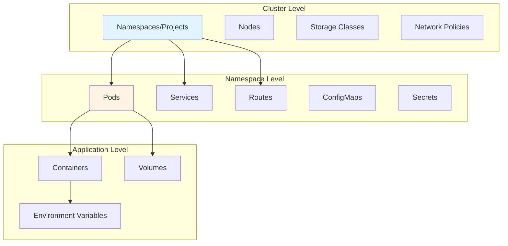
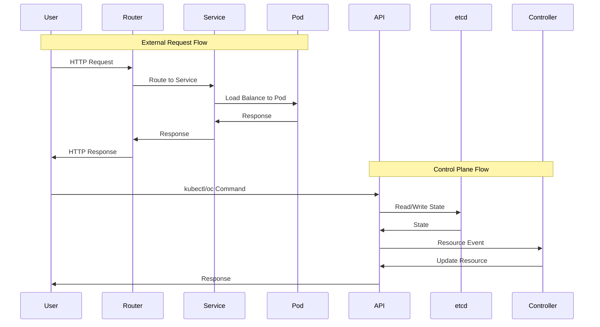
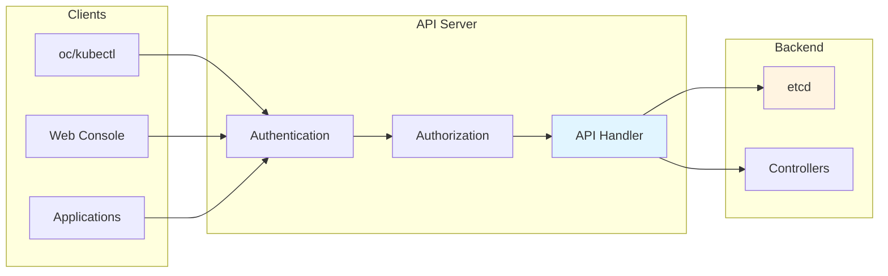
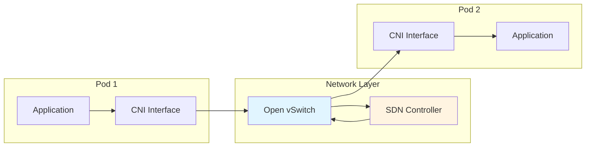

# OpenShift Navigation and Debugging Guide

This guide helps you navigate OpenShift clusters, understand component interactions, and debug issues effectively.

## Navigation Strategies

### Understanding the Cluster Structure



### Navigation Hierarchy

1. **Cluster → Namespaces → Resources → Pods → Containers**
2. **Network: External → Router → Service → Pod**
3. **API: Client → API Server → etcd → Controllers → Resources**

## Component Interaction Map

### Request Flow Through System



### Component Communication Patterns

#### 1. API Server Communication



#### 2. Pod-to-Pod Communication



#### 3. Service Discovery Flow

```mermaid
sequenceDiagram
    participant Pod
    participant CoreDNS
    participant Service
    participant Endpoints
    participant TargetPod
    
    Pod->>CoreDNS: DNS Query (service.namespace)
    CoreDNS->>Service: Resolve Service
    Service->>Endpoints: Get Endpoints
    Endpoints->>Pod: Return Pod IPs
    Pod->>CoreDNS: DNS Response
    Pod->>TargetPod: Connect to Pod IP
    
    style CoreDNS fill:#e1f5ff
    style Service fill:#fff4e1
```

## Debugging Strategies

### 1. Top-Down Debugging

Start from the highest level and work down:

```bash
# 1. Check cluster status
oc get clusteroperators
oc get nodes

# 2. Check namespace
oc get all -n <namespace>

# 3. Check specific resource
oc get <resource> -n <namespace>

# 4. Check pod details
oc describe pod <pod-name> -n <namespace>

# 5. Check container logs
oc logs <pod-name> -n <namespace>
```

### 2. Bottom-Up Debugging

Start from the lowest level and work up:

```bash
# 1. Check container logs
oc logs <pod-name> -c <container> -n <namespace>

# 2. Check pod events
oc get events -n <namespace> --field-selector involvedObject.name=<pod-name>

# 3. Check pod status
oc get pod <pod-name> -n <namespace> -o yaml

# 4. Check service endpoints
oc get endpoints <service-name> -n <namespace>

# 5. Check route
oc get route <route-name> -n <namespace>
```

### 3. Network Debugging

```bash
# Check pod network
oc exec <pod-name> -n <namespace> -- ip addr
oc exec <pod-name> -n <namespace> -- ip route
oc exec <pod-name> -n <namespace> -- ping <target>

# Check DNS
oc exec <pod-name> -n <namespace> -- nslookup <service>
oc exec <pod-name> -n <namespace> -- dig <service>

# Check network policies
oc get networkpolicies -n <namespace>
oc describe networkpolicy <policy-name> -n <namespace>

# Check service connectivity
oc exec <pod-name> -n <namespace> -- curl <service>:<port>
```

### 4. API Debugging

```bash
# Check API access
oc auth can-i <verb> <resource> -n <namespace>
oc whoami

# Check API resources
oc api-resources
oc api-versions

# Check resource details
oc get <resource> -n <namespace> -o yaml
oc describe <resource> -n <namespace>

# Watch resources
oc get <resource> -n <namespace> -w

# Check API server logs
oc logs -n openshift-kube-apiserver <api-server-pod>
```

## Common Debugging Scenarios

### Scenario 1: Pod Not Starting

```bash
# 1. Check pod status
oc get pod <pod-name> -n <namespace>

# 2. Check pod events
oc describe pod <pod-name> -n <namespace>

# 3. Check pod logs
oc logs <pod-name> -n <namespace> --previous

# 4. Check node resources
oc describe node <node-name>

# 5. Check image pull
oc get events -n <namespace> | grep <pod-name>
```

### Scenario 2: Service Not Accessible

```bash
# 1. Check service
oc get service <service-name> -n <namespace>
oc describe service <service-name> -n <namespace>

# 2. Check endpoints
oc get endpoints <service-name> -n <namespace>

# 3. Check pods behind service
oc get pods -l app=<label> -n <namespace>

# 4. Test from pod
oc run test-pod --image=busybox -it --rm -- sh
# Inside pod: wget -O- <service>:<port>

# 5. Check DNS
oc exec <pod> -n <namespace> -- nslookup <service>
```

### Scenario 3: Route Not Working

```bash
# 1. Check route
oc get route <route-name> -n <namespace>
oc describe route <route-name> -n <namespace>

# 2. Check router pods
oc get pods -n openshift-ingress
oc logs -n openshift-ingress <router-pod>

# 3. Check service
oc get service <service-name> -n <namespace>

# 4. Test route
curl -v http://<route-host>

# 5. Check DNS
dig <route-host>
```

### Scenario 4: Network Policy Blocking Traffic

```bash
# 1. List network policies
oc get networkpolicies -n <namespace>

# 2. Check policy details
oc describe networkpolicy <policy-name> -n <namespace>

# 3. Check pod labels
oc get pod <pod-name> -n <namespace> --show-labels

# 4. Test connectivity
oc exec <pod-name> -n <namespace> -- ping <target>

# 5. Temporarily disable policy (for testing)
oc delete networkpolicy <policy-name> -n <namespace>
```

### Scenario 5: API Request Failing

```bash
# 1. Check authentication
oc whoami
oc auth can-i <verb> <resource> -n <namespace>

# 2. Check API server status
oc get nodes
oc get clusteroperators

# 3. Check API server logs
oc logs -n openshift-kube-apiserver <api-server-pod>

# 4. Test API directly
curl -k -H "Authorization: Bearer $(oc whoami -t)" \
  https://<api-server>/api/v1/namespaces

# 5. Check RBAC
oc get rolebindings -n <namespace>
oc get clusterrolebindings
```

## Understanding Component Interactions

### How Pods Get Scheduled

```mermaid
sequenceDiagram
    participant User
    participant API as API Server
    participant Scheduler as Scheduler
    participant Kubelet as Kubelet
    participant CRIO as CRI-O
    participant Pod as Pod
    
    User->>API: Create Pod
    API->>etcd: Store Pod Spec
    Scheduler->>API: Watch Pods
    Scheduler->>Scheduler: Filter Nodes
    Scheduler->>Scheduler: Score Nodes
    Scheduler->>API: Bind Pod to Node
    API->>Kubelet: Pod Assignment
    Kubelet->>CRIO: Create Container
    CRIO->>Pod: Start Pod
    Pod->>Kubelet: Running Status
    Kubelet->>API: Update Pod Status
    
    style Scheduler fill:#e1f5ff
    style Kubelet fill:#fff4e1
```

### How Services Work

```mermaid
sequenceDiagram
    participant Pod
    participant KubeProxy as Kube-proxy
    participant Service as Service
    participant Endpoints as Endpoints
    participant TargetPod as Target Pod
    
    Pod->>Service: Request to Service IP
    Service->>KubeProxy: Intercept
    KubeProxy->>Endpoints: Get Pod IPs
    Endpoints->>KubeProxy: Pod IP List
    KubeProxy->>KubeProxy: Load Balance
    KubeProxy->>TargetPod: Forward to Pod
    TargetPod->>KubeProxy: Response
    KubeProxy->>Pod: Response
    
    style KubeProxy fill:#e1f5ff
    style Service fill:#fff4e1
```

### How Routes Work

```mermaid
sequenceDiagram
    participant User
    participant DNS as DNS
    participant Router as Router Pod
    participant HAProxy as HAProxy
    participant Service as Service
    participant Pod as Pod
    
    User->>DNS: Resolve Route Hostname
    DNS->>User: Router IP
    User->>Router: HTTP Request
    Router->>HAProxy: Route Request
    HAProxy->>HAProxy: Match Route Rule
    HAProxy->>Service: Forward to Service
    Service->>Pod: Load Balance
    Pod->>Service: Response
    Service->>HAProxy: Response
    HAProxy->>Router: Response
    Router->>User: HTTP Response
    
    style Router fill:#e1f5ff
    style HAProxy fill:#fff4e1
```

## Navigation Commands

### Cluster Navigation

```bash
# List all namespaces
oc get namespaces

# List all nodes
oc get nodes

# List cluster operators
oc get clusteroperators

# Get cluster info
oc cluster-info
```

### Namespace Navigation

```bash
# List all resources in namespace
oc get all -n <namespace>

# List specific resource types
oc get pods -n <namespace>
oc get services -n <namespace>
oc get routes -n <namespace>
oc get deployments -n <namespace>

# Get resource details
oc describe <resource> <name> -n <namespace>
```

### Resource Navigation

```bash
# Follow resource relationships
oc get <resource> <name> -n <namespace> -o yaml

# Check resource events
oc get events -n <namespace> --field-selector involvedObject.name=<name>

# Check resource status
oc get <resource> <name> -n <namespace> -o jsonpath='{.status}'
```

## Debugging Tools

### Built-in Tools

```bash
# oc command
oc get, describe, logs, exec, debug

# kubectl command (if available)
kubectl get, describe, logs, exec
```

### External Tools

```bash
# Network debugging
tcpdump, wireshark, tshark

# API debugging
curl, httpie, postman

# Container debugging
docker, podman, crictl
```

## Best Practices

1. **Start High, Go Low**: Begin with cluster-level checks, then narrow down
2. **Use Events**: Always check events for resource issues
3. **Check Logs**: Review logs at multiple levels (pod, container, application)
4. **Verify Connectivity**: Test network connectivity between components
5. **Check Permissions**: Verify RBAC and network policies
6. **Use Describe**: `oc describe` provides comprehensive information
7. **Watch Resources**: Use `-w` flag to watch resource changes
8. **Compare States**: Compare desired vs actual state

