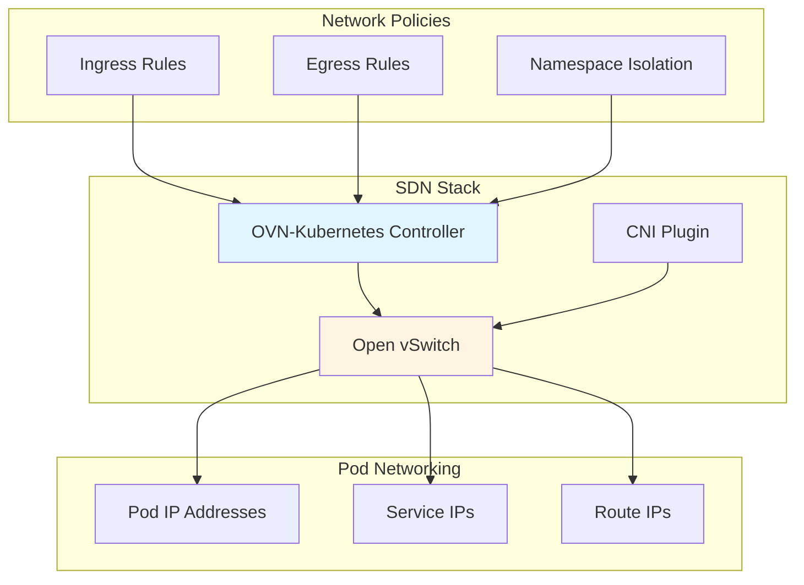
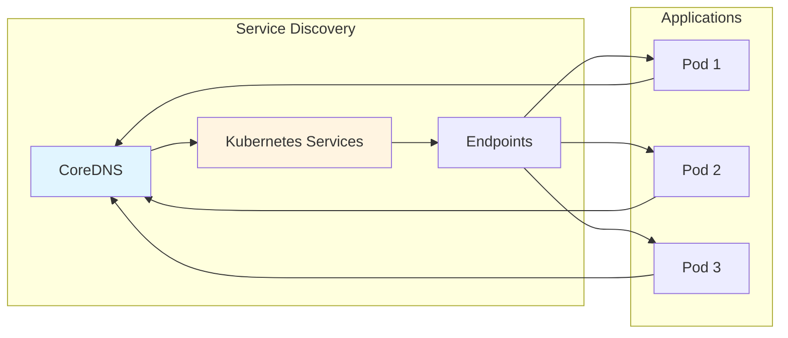
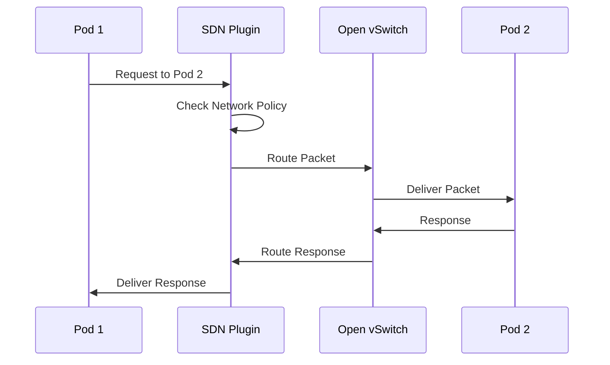
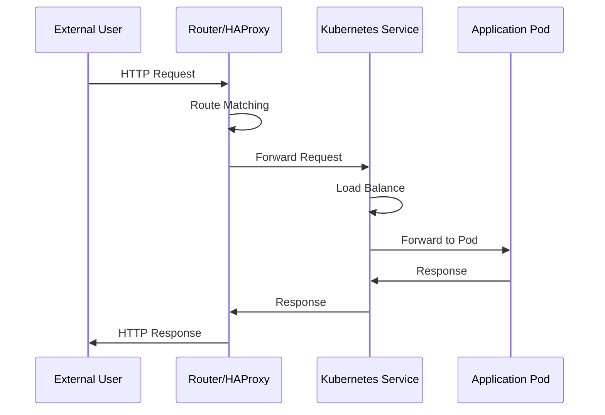
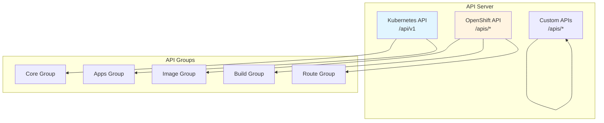
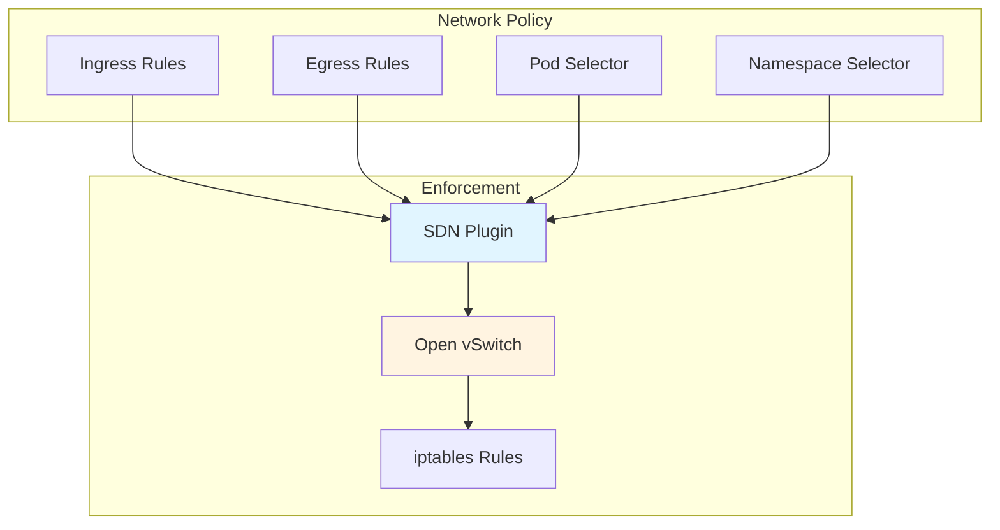
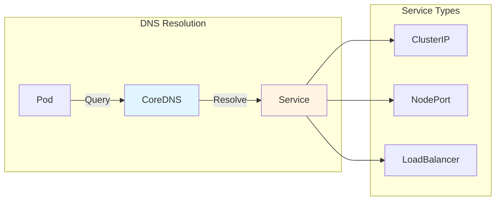
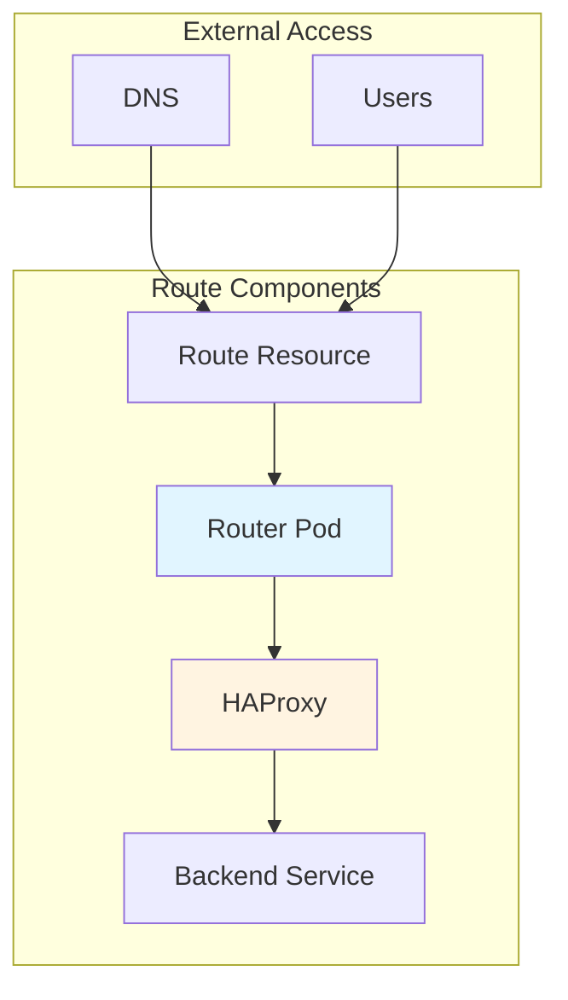

# OpenShift Network and API Guide

This guide explains OpenShift networking, APIs, and how components communicate.

## Network Architecture

### Network Layers

OpenShift uses a layered networking approach:

1. **Pod Network**: Each pod gets its own IP address
2. **Service Network**: Virtual IPs for service discovery
3. **External Network**: Routes and ingress for external access
4. **Node Network**: Physical network connecting nodes

### Network Components

#### SDN (Software-Defined Networking)

OpenShift uses OVN-Kubernetes as the default SDN:



#### Service Discovery



### Network Flow Examples

#### Pod-to-Pod Communication



#### External Access Flow



## API Architecture

### API Server Structure



### API Request Flow

```mermaid
sequenceDiagram
    participant Client
    participant Auth as Authentication
    participant Authz as Authorization
    participant API as API Server
    participant Admission as Admission Control
    participant etcd as etcd
    participant Controller as Controllers
    
    Client->>Auth: Request + Credentials
    Auth->>Auth: Validate (Token/Cert)
    Auth->>Authz: Check Permissions
    Authz->>API: Authorized Request
    API->>Admission: Validate/Mutate
    Admission->>API: Validated Request
    API->>etcd: Write State
    etcd->>API: Confirmation
    API->>Controller: Event Notification
    Controller->>API: Reconcile
    API->>Client: Response
    
    style API fill:#e1f5ff
    style etcd fill:#fff4e1
```

### OpenShift API Extensions

#### Image API

```yaml
# ImageStream
apiVersion: image.openshift.io/v1
kind: ImageStream
metadata:
  name: my-app
spec:
  lookupPolicy:
    local: true
```

#### Build API

```yaml
# BuildConfig
apiVersion: build.openshift.io/v1
kind: BuildConfig
metadata:
  name: my-build
spec:
  source:
    type: Git
    git:
      uri: https://github.com/user/repo
  strategy:
    type: Source
    sourceStrategy:
      from:
        kind: ImageStreamTag
        name: builder:latest
```

#### Route API

```yaml
# Route
apiVersion: route.openshift.io/v1
kind: Route
metadata:
  name: my-route
spec:
  to:
    kind: Service
    name: my-service
  port:
    targetPort: 8080
```

## Network Policies

### Network Policy Architecture



### Network Policy Examples

```yaml
# Allow ingress from same namespace
apiVersion: networking.k8s.io/v1
kind: NetworkPolicy
metadata:
  name: allow-same-namespace
spec:
  podSelector: {}
  ingress:
  - from:
    - podSelector: {}
```

```yaml
# Allow ingress from specific namespace
apiVersion: networking.k8s.io/v1
kind: NetworkPolicy
metadata:
  name: allow-from-namespace
spec:
  podSelector: {}
  ingress:
  - from:
    - namespaceSelector:
        matchLabels:
          name: allowed-namespace
```

## Service Discovery

### DNS-Based Discovery



### Service Types

1. **ClusterIP**: Internal service, accessible only within cluster
2. **NodePort**: Exposes service on node IP and port
3. **LoadBalancer**: External load balancer (cloud provider)
4. **ExternalName**: Maps to external DNS name

## Routes and Ingress

### Route Architecture



### Route Types

1. **Edge**: TLS termination at router
2. **Passthrough**: TLS passthrough to backend
3. **Reencrypt**: TLS termination and re-encryption

## API Endpoints

### Core Kubernetes APIs

- `/api/v1` - Core resources (Pods, Services, etc.)
- `/apis/apps/v1` - Apps resources (Deployments, etc.)
- `/apis/networking.k8s.io/v1` - Network policies
- `/apis/rbac.authorization.k8s.io/v1` - RBAC

### OpenShift APIs

- `/apis/image.openshift.io/v1` - ImageStreams, Images
- `/apis/build.openshift.io/v1` - Builds, BuildConfigs
- `/apis/route.openshift.io/v1` - Routes
- `/apis/project.openshift.io/v1` - Projects
- `/apis/template.openshift.io/v1` - Templates

### API Discovery

```bash
# Discover available APIs
oc api-resources

# Get API versions
oc api-versions

# Describe specific API
oc explain imagestream
```

## Network Debugging

### Common Network Commands

```bash
# Check pod network
oc exec <pod> -- ip addr
oc exec <pod> -- ip route

# Check service endpoints
oc get endpoints <service>

# Check network policies
oc get networkpolicies
oc describe networkpolicy <name>

# Check routes
oc get routes
oc describe route <name>

# Check DNS
oc exec <pod> -- nslookup <service>
oc exec <pod> -- dig <service>
```

### Network Troubleshooting

1. **Pod can't reach service**:
   - Check service endpoints: `oc get endpoints`
   - Check network policies
   - Check DNS resolution
   - Check pod network configuration

2. **External access not working**:
   - Check route configuration
   - Check router pods
   - Check DNS configuration
   - Check firewall rules

3. **Network policies blocking traffic**:
   - List network policies: `oc get networkpolicies`
   - Check policy selectors
   - Verify policy rules
   - Test with policy disabled

## API Debugging

### Common API Commands

```bash
# Get API resources
oc api-resources

# Get resource details
oc get <resource> -o yaml
oc describe <resource>

# Watch resources
oc get <resource> -w

# Check API server logs
oc logs -n openshift-kube-apiserver <pod>

# Test API access
oc auth can-i <verb> <resource>
```

### API Troubleshooting

1. **API request failing**:
   - Check authentication: `oc whoami`
   - Check authorization: `oc auth can-i`
   - Check API server status
   - Review API server logs

2. **Resource not found**:
   - Check namespace: `oc project`
   - Verify resource exists
   - Check RBAC permissions
   - Verify API version

3. **Admission control issues**:
   - Check admission webhooks
   - Review admission controller logs
   - Check resource validation
   - Verify SCCs

## Best Practices

1. **Use Services for internal communication**
2. **Use Routes for external access**
3. **Implement Network Policies for security**
4. **Use DNS for service discovery**
5. **Monitor network metrics**
6. **Test network policies before production**
7. **Use proper RBAC for API access**
8. **Validate resources before applying**

