# Prow Component Interactions Guide

This guide explains how Prow components interact with each other and how to understand these interactions.

## Core Component Interactions

### Webhook Processing Flow

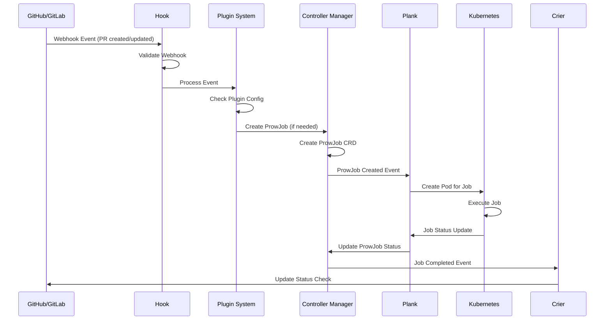

### Job Execution Flow

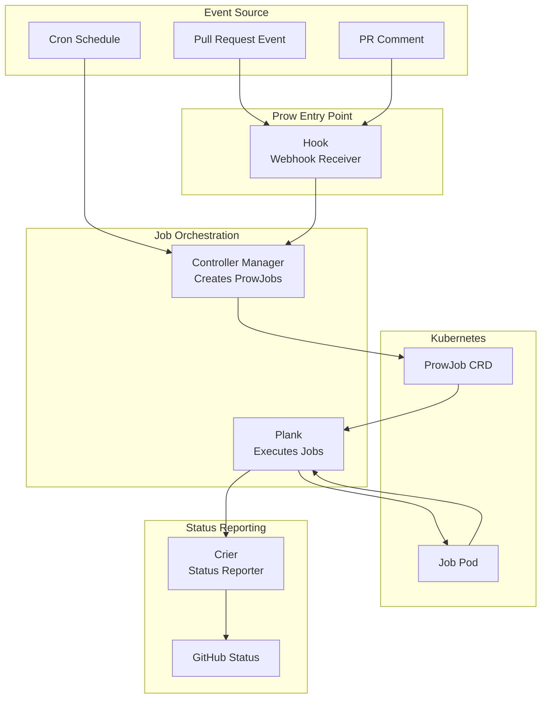

### Tide Merge Flow

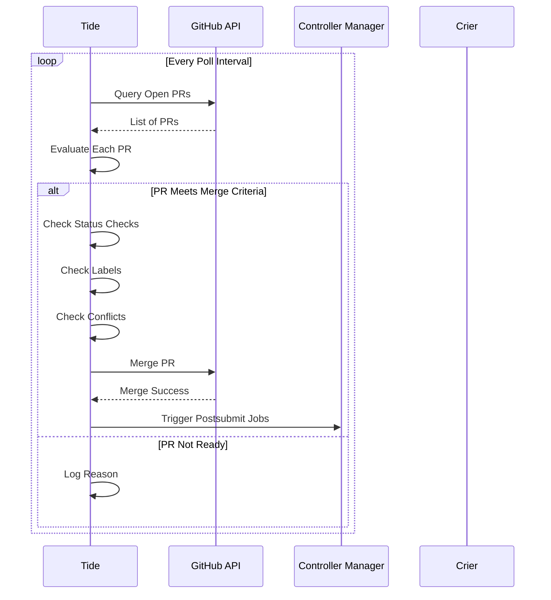

## Component Communication Patterns

### Hook to Controller Communication

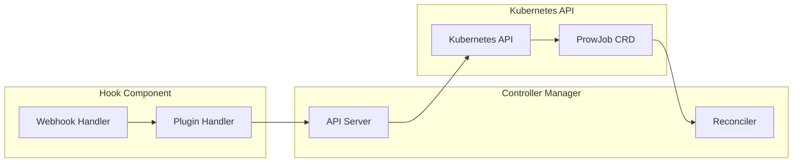

### Plank Job Execution

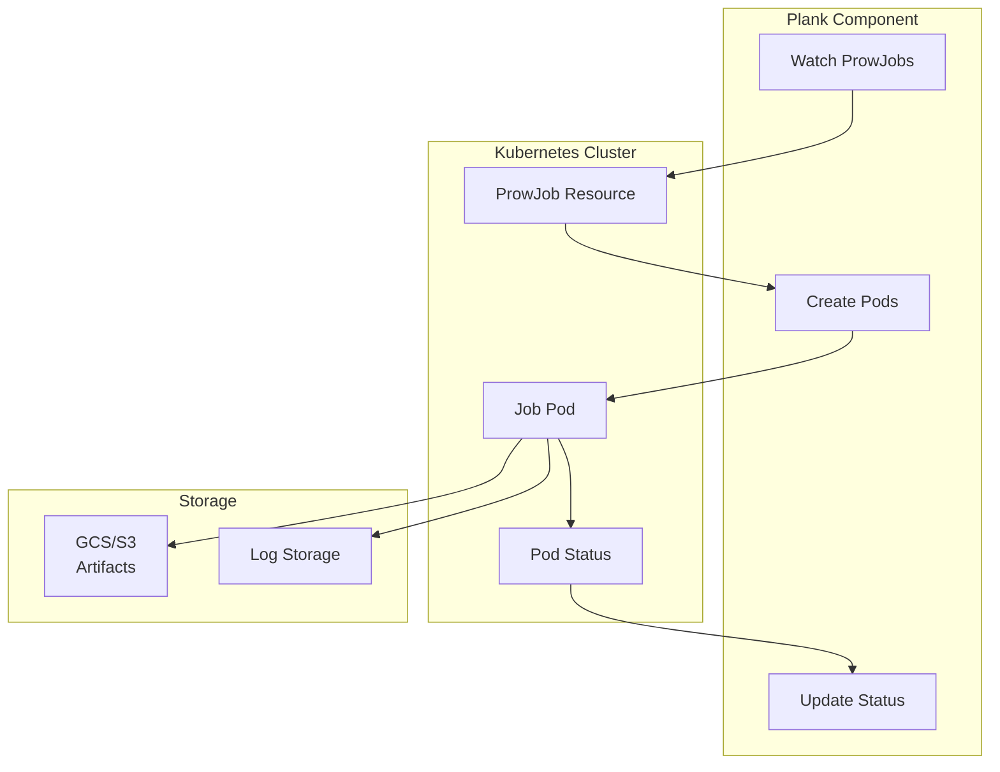

### Crier Status Reporting

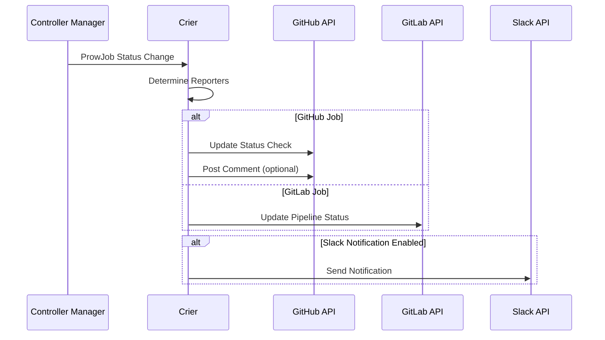

## Plugin System Interactions

### Plugin Command Processing

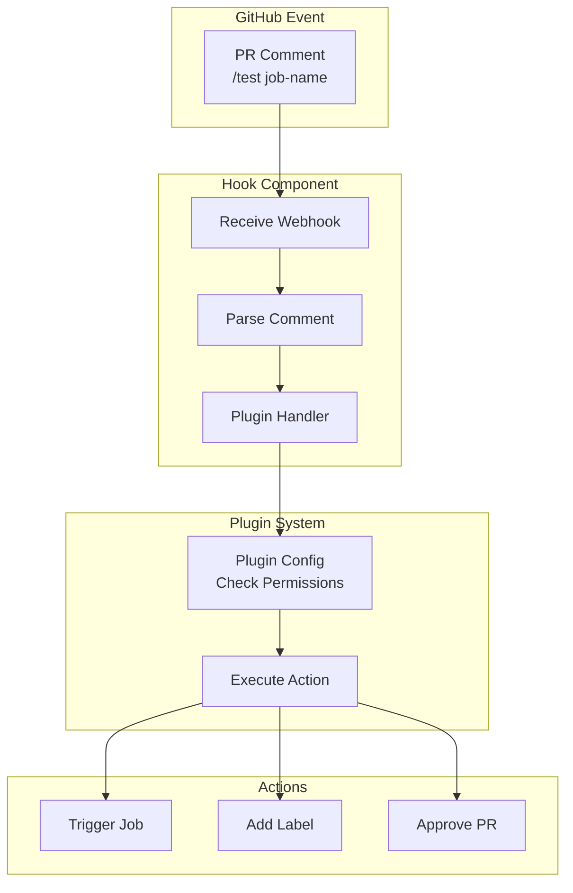

### Common Plugin Commands Flow

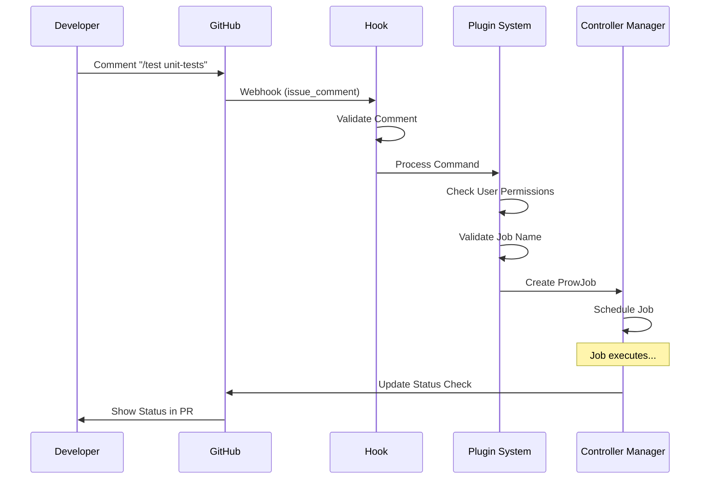

## Sinker Cleanup Flow

```mermaid
graph TB
    subgraph "Sinker Component"
        SinkerWatch[Watch ProwJobs]
        SinkerCheck[Check Age]
        SinkerDelete[Delete Old Jobs]
    end
    
    subgraph "Kubernetes"
        OldProwJob[Old ProwJob<br/>Completed > TTL]
        OldPod[Old Pod<br/>Completed]
    end
    
    subgraph "Storage"
        Artifacts[Artifacts<br/>Retained]
    end
    
    SinkerWatch --> OldProwJob
    SinkerCheck --> OldProwJob
    alt Job Older Than TTL
        SinkerDelete --> OldProwJob
        SinkerDelete --> OldPod
    end
    OldProwJob -.-> Artifacts
```

## Deck (Web UI) Interactions

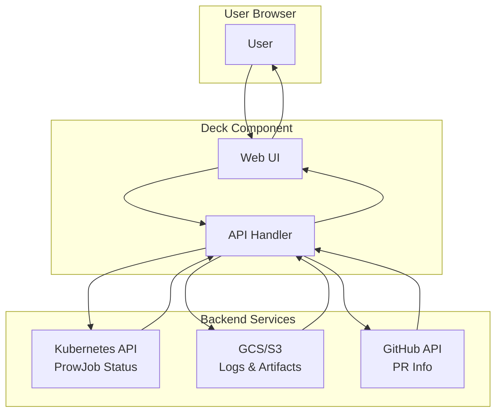

## Configuration Flow

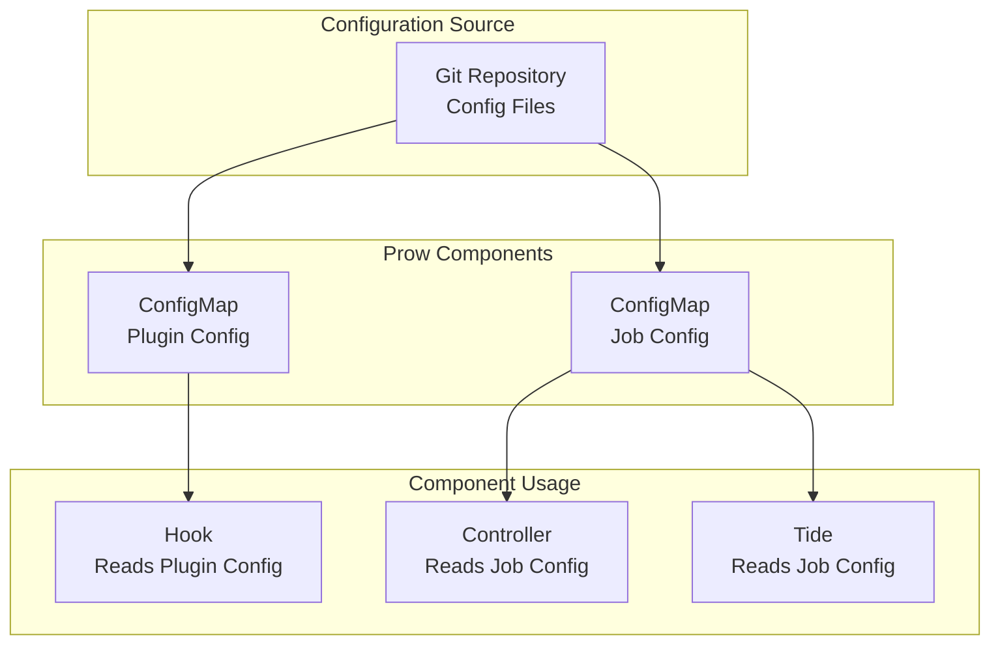

## Error Handling and Retry Logic

### Job Failure Flow

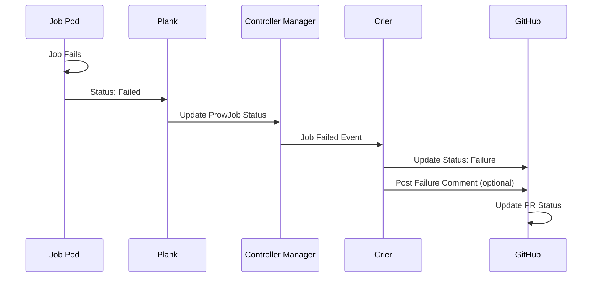

### Retry Logic

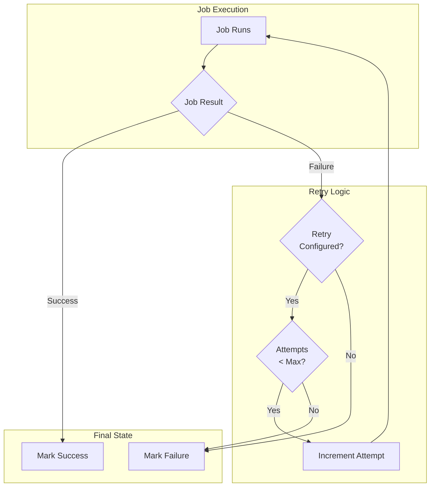

## Multi-Cluster Interactions

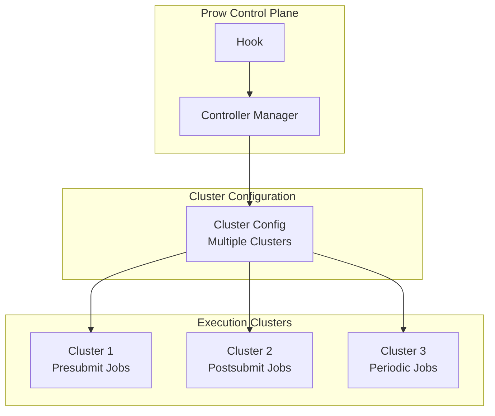

## Security and Authentication Flow

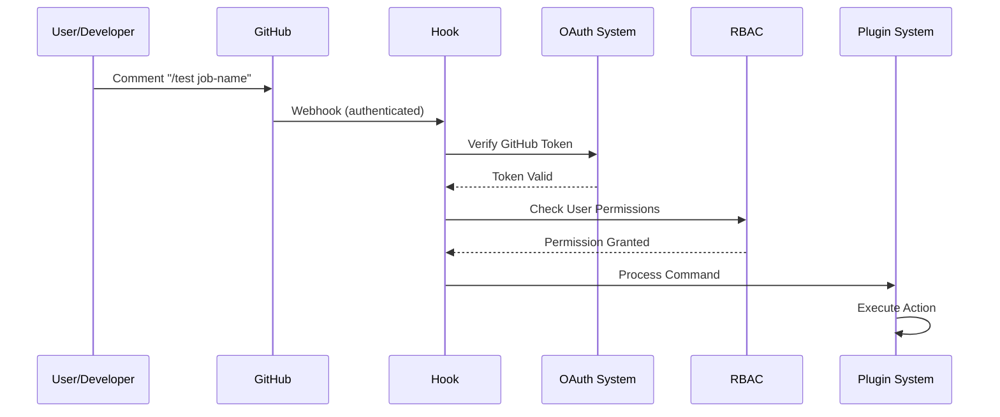

## Summary

Prow components interact through well-defined patterns:

1. **Event-Driven**: Components react to events (webhooks, Kubernetes events, schedules)
2. **Kubernetes-Native**: Uses Kubernetes APIs and CRDs for job management
3. **Stateless Components**: Most components are stateless and can scale horizontally
4. **Configuration-Driven**: Behavior controlled through YAML configuration files
5. **Async Processing**: Jobs execute asynchronously with status reporting
6. **Clean Separation**: Clear separation between orchestration (Controller), execution (Plank), and reporting (Crier)

Understanding these interaction patterns helps with:
- **Debugging**: Knowing which component to check when issues occur
- **Configuration**: Understanding how configuration affects component behavior
- **Troubleshooting**: Tracing issues through the component flow
- **Extension**: Adding custom components or modifying behavior

