# Prow Architecture

## Overview

This diagram provides a beginner-friendly view of how Prow (a Kubernetes-based CI/CD system) is structured and how its major components work together. Prow is designed to automate testing, code review, and deployment workflows for Kubernetes and other open-source projects. The architecture is organized into logical layers that show the flow from developers and code repositories down to the underlying infrastructure.

## Architecture Diagram

```mermaid
graph TB
    subgraph "User & Development Layer"
        Developers[👥 Developers]
        CodeRepo[📦 Code Repository<br/>GitHub/GitLab<br/>Source code and pull requests]
        PR[Pull Requests<br/>Code changes<br/>Waiting for review and testing]
    end

    subgraph "Prow API & Web Layer"
        Hook[Hook<br/>Webhook Receiver<br/>Receives events from GitHub/GitLab]
        Deck[Deck<br/>Web UI Dashboard<br/>View jobs, logs, and status]
        API[Prow API<br/>REST API<br/>Programmatic access to Prow]
    end

    subgraph "Prow Core Components"
        Controller[Prow Controller Manager<br/>Orchestrates ProwJobs<br/>Manages job lifecycle]
        Plank[Plank<br/>Job Executor<br/>Creates Kubernetes pods for jobs]
        Sinker[Sinker<br/>Cleanup Service<br/>Removes old completed jobs]
        Tide[Tide<br/>Merge Bot<br/>Automatically merges PRs when ready]
        Crier[Crier<br/>Status Reporter<br/>Reports job status back to GitHub]
    end

    subgraph "Job Management Layer"
        Presubmit[Presubmit Jobs<br/>Run on PRs<br/>Validate code before merge]
        Postsubmit[Postsubmit Jobs<br/>Run after merge<br/>Build and deploy artifacts]
        Periodic[Periodic Jobs<br/>Scheduled runs<br/>Regular testing and maintenance]
        ProwJob[ProwJob CRD<br/>Kubernetes Custom Resource<br/>Defines job specifications]
    end

    subgraph "Plugin System"
        Plugins[Plugins<br/>Automation Rules<br/>/test, /retest, /approve commands]
        PluginConfig[Plugin Config<br/>YAML Configuration<br/>Defines plugin behavior]
        JobConfig[Job Config<br/>Job Definitions<br/>What jobs to run and when]
    end

    subgraph "Kubernetes Execution Layer"
        K8sCluster[Kubernetes Cluster<br/>Compute Platform<br/>Runs job pods]
        Pods[Job Pods<br/>Containerized Jobs<br/>Execute tests and builds]
        Namespaces[Namespaces<br/>Job Isolation<br/>Separate environments]
        Secrets[Kubernetes Secrets<br/>Credentials<br/>GitHub tokens, SSH keys]
    end

    subgraph "Storage & Artifacts Layer"
        GCS[GCS/S3<br/>Artifact Storage<br/>Store build outputs and logs]
        PVC[Persistent Volumes<br/>Job Storage<br/>Temporary storage for jobs]
        Logs[Log Storage<br/>Job Logs<br/>Centralized log collection]
    end

    subgraph "Security & Access Layer"
        RBAC[RBAC<br/>Role-Based Access<br/>Control who can trigger jobs]
        OAuth[OAuth/GitHub Auth<br/>Authentication<br/>Verify user identity]
        SecretsMgr[Secrets Manager<br/>Credential Storage<br/>Secure token management]
    end

    subgraph "Monitoring & Operations Layer"
        Metrics[Metrics<br/>Prometheus<br/>Track job performance]
        Logging[Logging<br/>Centralized Logs<br/>Collect and analyze logs]
        Alerts[Alerts<br/>Monitoring<br/>Notify on failures]
        Tracing[Tracing<br/>Distributed Tracing<br/>Track job execution flow]
    end

    subgraph "External Integrations"
        GitHub[GitHub<br/>Code Hosting<br/>Source code and PRs]
        GitLab[GitLab<br/>Code Hosting<br/>Alternative code repository]
        Slack[Slack<br/>Notifications<br/>Job status updates]
        Email[Email<br/>Notifications<br/>Job completion alerts]
    end

    %% User to Repository connections
    Developers --> CodeRepo
    Developers --> PR
    CodeRepo --> PR

    %% Repository to Prow connections
    PR --> Hook
    CodeRepo --> Hook
    GitHub --> Hook
    GitLab --> Hook

    %% Hook to Core Components
    Hook --> Controller
    Hook --> Plugins
    Hook --> Tide

    %% Controller to Job Management
    Controller --> ProwJob
    Controller --> Plank
    Controller --> Crier

    %% Job Types
    ProwJob --> Presubmit
    ProwJob --> Postsubmit
    ProwJob --> Periodic

    %% Plank to Kubernetes
    Plank --> K8sCluster
    Presubmit --> Pods
    Postsubmit --> Pods
    Periodic --> Pods
    Pods --> K8sCluster
    Pods --> Namespaces
    Pods --> Secrets

    %% Job Execution to Storage
    Pods --> GCS
    Pods --> PVC
    Pods --> Logs

    %% Status Reporting
    Crier --> GitHub
    Crier --> GitLab
    Crier --> Slack
    Crier --> Email

    %% Web UI
    Developers --> Deck
    Deck --> API
    API --> Controller
    Deck --> Logs
    Deck --> Metrics

    %% Plugin System
    Plugins --> PluginConfig
    Plugins --> JobConfig
    JobConfig --> Controller

    %% Security
    Hook --> OAuth
    Controller --> RBAC
    Pods --> SecretsMgr
    SecretsMgr --> Secrets

    %% Monitoring
    Controller --> Metrics
    Pods --> Logging
    Metrics --> Alerts
    Pods --> Tracing

    %% Styling
    classDef userLayer fill:#e1f5ff
    classDef apiLayer fill:#fff4e1
    classDef coreLayer fill:#e8f5e9
    classDef jobLayer fill:#f3e5f5
    classDef k8sLayer fill:#e0f2f1
    classDef storageLayer fill:#fff9c4
    classDef securityLayer fill:#ffebee
    classDef opsLayer fill:#f1f8e9
    classDef extLayer fill:#fce4ec

    class Developers,CodeRepo,PR userLayer
    class Hook,Deck,API apiLayer
    class Controller,Plank,Sinker,Tide,Crier coreLayer
    class Presubmit,Postsubmit,Periodic,ProwJob jobLayer
    class K8sCluster,Pods,Namespaces,Secrets k8sLayer
    class GCS,PVC,Logs storageLayer
    class RBAC,OAuth,SecretsMgr securityLayer
    class Metrics,Logging,Alerts,Tracing opsLayer
    class GitHub,GitLab,Slack,Email extLayer
```

## Component Descriptions

### 1. User & Development Layer
**Purpose**: The entry point where developers interact with the system.

- **Developers**: Software engineers who write code and create pull requests.
- **Code Repository**: Where source code lives (typically GitHub or GitLab).
- **Pull Requests**: Proposed code changes that need review and testing before merging.

**How it works**: Developers push code changes to repositories and create pull requests. Prow monitors these repositories for events like new PRs, comments, or code pushes.

### 2. Prow API & Web Layer
**Purpose**: Interfaces for interacting with Prow.

- **Hook**: Receives webhooks from GitHub/GitLab when events occur (new PR, comment, push, etc.). This is Prow's entry point for external events.
- **Deck**: Web-based dashboard where users can view job status, logs, and history. Provides a user-friendly interface to monitor CI/CD activities.
- **Prow API**: RESTful API for programmatic access to Prow functionality, allowing automation and integration with other tools.

**How it works**: When a developer creates a PR or comments, GitHub sends a webhook to Hook. Deck provides a visual interface to see what's happening, and the API allows scripts and tools to interact with Prow.

### 3. Prow Core Components
**Purpose**: The brain of Prow that orchestrates all CI/CD activities.

- **Prow Controller Manager**: Main orchestrator that watches for ProwJob resources and manages their lifecycle. It decides when to create, update, or delete jobs.
- **Plank**: Executes jobs by creating Kubernetes pods. It reads ProwJob definitions and translates them into actual running containers.
- **Sinker**: Cleanup service that removes old completed jobs and their associated pods to prevent resource accumulation.
- **Tide**: Automated merge bot that merges pull requests when all required checks pass and approvals are met. It continuously evaluates PR status.
- **Crier**: Reports job status back to GitHub/GitLab, updating PR status checks and posting comments with results.

**How it works**: Controller Manager coordinates everything. When a job needs to run, Plank creates a pod. Sinker cleans up afterward. Tide watches PRs and merges them when ready. Crier keeps everyone informed by updating status checks.

### 4. Job Management Layer
**Purpose**: Defines and manages different types of CI/CD jobs.

- **Presubmit Jobs**: Run automatically when a PR is created or updated. They validate code before it's merged (e.g., run tests, check formatting).
- **Postsubmit Jobs**: Run after code is merged to the main branch. They typically build artifacts, run integration tests, or deploy to staging.
- **Periodic Jobs**: Run on a schedule (e.g., daily, weekly). Used for maintenance tasks, long-running tests, or regular builds.
- **ProwJob CRD**: Kubernetes Custom Resource Definition that represents a job. It contains all the information needed to run a job (container image, commands, environment variables, etc.).

**How it works**: Job configurations define what should run when. Presubmits catch issues early, postsubmits ensure merged code works, and periodics keep things maintained.

### 5. Plugin System
**Purpose**: Extends Prow's functionality with automation and custom behaviors.

- **Plugins**: Respond to comments and commands in PRs (e.g., `/test`, `/retest`, `/approve`, `/lgtm`). They enable developers to trigger jobs or perform actions via comments.
- **Plugin Config**: YAML configuration that defines which plugins are enabled and how they behave.
- **Job Config**: YAML files that define what jobs exist, when they should run, and what they should do.

**How it works**: Developers can comment commands on PRs. Plugins interpret these commands and trigger appropriate actions. Job configs define the actual jobs that can be run.

### 6. Kubernetes Execution Layer
**Purpose**: The compute platform where jobs actually run.

- **Kubernetes Cluster**: The underlying infrastructure that provides compute resources (CPU, memory, storage) for running jobs.
- **Job Pods**: Containerized environments where individual jobs execute. Each job runs in its own isolated pod.
- **Namespaces**: Logical separation of jobs, allowing different teams or projects to have isolated environments.
- **Kubernetes Secrets**: Secure storage for credentials like GitHub tokens, SSH keys, and API keys that jobs need to access.

**How it works**: When a job needs to run, Prow creates a pod in Kubernetes. The pod runs the specified container image, executes commands, and produces outputs. Secrets provide secure access to external services.

### 7. Storage & Artifacts Layer
**Purpose**: Stores job outputs, logs, and build artifacts.

- **GCS/S3**: Object storage (Google Cloud Storage or AWS S3) where build artifacts, test results, and logs are stored long-term.
- **Persistent Volumes**: Temporary storage attached to job pods for files that need to persist during job execution.
- **Log Storage**: Centralized location where all job logs are collected for easy access and analysis.

**How it works**: Jobs produce outputs (binaries, test reports, logs). These are uploaded to cloud storage for long-term retention and shared with developers through Deck.

### 8. Security & Access Layer
**Purpose**: Ensures only authorized users can trigger jobs and access resources.

- **RBAC**: Role-Based Access Control in Kubernetes that determines which users or service accounts can create jobs or access resources.
- **OAuth/GitHub Auth**: Authentication mechanism that verifies users are who they claim to be using GitHub's OAuth system.
- **Secrets Manager**: Secure storage and management of sensitive credentials that jobs need to run.

**How it works**: When a user tries to trigger a job, OAuth verifies their identity. RBAC checks if they have permission. Secrets are securely injected into pods when needed.

### 9. Monitoring & Operations Layer
**Purpose**: Observability into Prow's health and job performance.

- **Metrics**: Prometheus metrics that track job success rates, execution times, resource usage, and system health.
- **Logging**: Centralized collection of logs from all Prow components and jobs for debugging and auditing.
- **Alerts**: Automated notifications when jobs fail repeatedly, systems are unhealthy, or thresholds are exceeded.
- **Tracing**: Distributed tracing to understand how requests flow through Prow components and identify bottlenecks.

**How it works**: All components emit metrics and logs. Monitoring systems collect this data, detect anomalies, and alert operators when issues occur.

### 10. External Integrations
**Purpose**: Connections to external services that Prow interacts with.

- **GitHub/GitLab**: Code hosting platforms where source code lives and where Prow receives events and reports status.
- **Slack/Email**: Notification channels where job results and system alerts are sent to keep teams informed.

**How it works**: Prow integrates with code hosting platforms to receive events and report status. It can also send notifications to communication channels.

## Key Data Flows

### 1. Pull Request Testing Flow (Presubmit)
1. Developer creates or updates a pull request on GitHub
2. GitHub sends a webhook event to Prow's Hook component
3. Hook processes the event and checks plugin configuration
4. Controller Manager creates a ProwJob resource for the presubmit job
5. Plank reads the ProwJob and creates a Kubernetes pod
6. The pod runs the test container, executing tests and builds
7. Job outputs and logs are uploaded to GCS/S3
8. Crier reports the job status back to GitHub as a status check
9. Developer sees the test results in the GitHub PR interface
10. If all checks pass, Tide can automatically merge the PR

### 2. Post-Merge Build Flow (Postsubmit)
1. Code is merged to the main branch
2. GitHub sends a webhook to Hook indicating the merge
3. Hook triggers postsubmit jobs defined in job config
4. Controller Manager creates ProwJob resources
5. Plank creates pods that build artifacts (Docker images, binaries)
6. Build outputs are pushed to registries and stored in GCS/S3
7. Crier reports success/failure status
8. Optional: Deployment jobs may be triggered to deploy to staging/production

### 3. Scheduled Job Flow (Periodic)
1. Cron scheduler in Controller Manager triggers periodic jobs based on schedule
2. Controller Manager creates ProwJob resources for scheduled jobs
3. Plank creates pods that run maintenance tasks, long tests, or regular builds
4. Jobs execute and produce outputs
5. Results are stored in GCS/S3
6. Metrics are collected for monitoring
7. If jobs fail, alerts are sent to operators

### 4. Manual Job Trigger Flow (via Comments)
1. Developer comments `/test job-name` on a PR
2. GitHub sends webhook to Hook with the comment event
3. Hook's plugin system interprets the command
4. Plugin validates the user has permission and the job exists
5. Controller Manager creates a ProwJob for the requested job
6. Job executes as described in the presubmit flow
7. Results are reported back via Crier
8. Developer sees the job status in the PR

### 5. Automatic Merge Flow (Tide)
1. Developer creates a PR that passes all required checks
2. PR receives necessary approvals and labels
3. Tide continuously evaluates PRs against merge criteria
4. When all conditions are met (tests pass, approvals, no conflicts), Tide merges the PR
5. Merge triggers postsubmit jobs
6. Crier updates the PR with final status

## Common Use Cases

### Microservices Testing
- Multiple presubmit jobs test different services in parallel
- Integration tests run after individual service tests pass
- Postsubmit jobs build and push Docker images for each service
- Periodic jobs run end-to-end tests across all services

### Multi-Environment Deployment
- Presubmit jobs validate code quality
- Postsubmit jobs deploy to development environment
- Additional postsubmit jobs deploy to staging after successful dev deployment
- Manual approval gates before production deployment
- Periodic jobs validate production health

### Release Management
- Periodic jobs build release candidates
- Postsubmit jobs tag releases and create artifacts
- Jobs publish to package registries and update documentation
- Automated changelog generation and release notes

## Best Practices

1. **Job Organization**: Group related jobs in the same job config file, use clear naming conventions
2. **Resource Management**: Set appropriate resource limits on jobs to prevent cluster resource exhaustion
3. **Secret Management**: Use Kubernetes secrets and never hardcode credentials in job configs
4. **Monitoring**: Set up alerts for job failure rates and system health metrics
5. **Cleanup**: Configure Sinker to aggressively clean up old jobs to prevent resource accumulation
6. **Security**: Use RBAC to restrict who can trigger expensive or sensitive jobs
7. **Documentation**: Keep job configs well-documented so teams understand what each job does

## Summary

Prow is a powerful CI/CD system that automates testing, building, and deployment workflows for Kubernetes-based projects. It integrates deeply with code hosting platforms like GitHub, uses Kubernetes as its execution engine, and provides extensive automation through plugins and job configurations. The layered architecture separates concerns: webhooks and APIs handle external interactions, core components orchestrate jobs, Kubernetes provides compute resources, and storage/monitoring ensure observability and artifact retention. This design makes Prow highly scalable, flexible, and suitable for large open-source projects with complex testing and deployment requirements.

